# CodeVault — Master Architecture, Design & Engineering Reference

> **Version:** 2.0 · **Stack:** Next.js 16.2.7 / PostgreSQL 16 / Redis 7 / Monaco Editor (write) + Shiki (read)  
> **Audience:** Engineering team, contributors, reviewers  
> **Goal:** Production-grade DSA problem tracker with spaced repetition, designed for 10k+ users and 100k+ problems at zero perceived latency  
> **Timestamps:** All application + DB timestamps displayed in `dd-MON-yyyy HH:mm IST` format (e.g. `05-JUN-2026 14:30 IST`)

---

## Table of Contents

1. [Goals & Scope](#1-goals--scope)
2. [Tech Stack & Dependency Matrix](#2-tech-stack--dependency-matrix)
3. [Repository Structure (Next.js 16 App Router)](#3-repository-structure)
4. [Database Schema — ER Diagram](#4-database-schema--er-diagram)
5. [Data Models — Field-Level Specification](#5-data-models--field-level-specification)
6. [API Endpoint Catalog](#6-api-endpoint-catalog)
7. [UI/UX Layout Specification](#7-uiux-layout-specification)
8. [Full UML Suite](#8-full-uml-suite)
   - [8.1 System Architecture (Component Diagram)](#81-system-architecture)
   - [8.2 Frontend Component Tree](#82-frontend-component-tree)
   - [8.3 Backend Service Class Diagram](#83-backend-service-class-diagram)
   - [8.4 Sequence: Auth + Onboarding](#84-sequence-auth--onboarding)
   - [8.5 Sequence: Add Problem → Solution → SRS Init](#85-sequence-add-problem--solution--srs-init)
   - [8.6 Sequence: SRS Notification Polling & Review](#86-sequence-srs-notification-polling--review)
   - [8.7 Sequence: Public Sheet Access (Cross-user)](#87-sequence-public-sheet-access)
   - [8.8 Problem Lifecycle State Machine](#88-problem-lifecycle-state-machine)
   - [8.9 SRS Engine Activity Diagram (with Revisit)](#89-srs-engine-activity-diagram)
   - [8.10 Use Case Overview](#810-use-case-overview)
9. [Spaced Repetition Engine — Deep Dive](#9-spaced-repetition-engine--deep-dive)
10. [Onboarding — Default Language Selection](#10-onboarding--default-language-selection)
11. [Syntax Highlighting — Shiki (display) + Monaco (edit)](#11-syntax-highlighting--shiki--monaco)
12. [IST Timestamp Standard](#12-ist-timestamp-standard)
13. [Performance & Scalability Blueprint](#13-performance--scalability-blueprint)
    - [13.1 PostgreSQL Indexing Strategy (DDL)](#131-postgresql-indexing-strategy)
    - [13.2 Table Partitioning](#132-table-partitioning)
    - [13.3 Redis Data Structure Map](#133-redis-data-structure-map)
    - [13.4 Frontend Performance](#134-frontend-performance)
    - [13.5 Connection Pooling & Edge Deployment](#135-connection-pooling--edge-deployment)
14. [Security Checklist](#14-security-checklist)
15. [Additional Features Roadmap](#15-additional-features-roadmap)
16. [Phase-Wise Implementation Plan](#16-phase-wise-implementation-plan)
17. [Git Commit Conventions](#17-git-commit-conventions)

---

## 1. Goals & Scope

| Goal | Mechanism | Target Metric |
|---|---|---|
| **Track** problems from any OJ | Manual entry + URL field | < 500ms modal open |
| **Solve** with multi-language solutions | Monaco Editor (40+ langs) | < 200ms keystroke lag |
| **Remember** via SRS | Redis-queued intervals (3d/7d/15d/30d) | < 50ms queue poll |
| **Share** knowledge publicly | Per-problem + Sheet public links | CDN-cached read paths |
| **Analyse** growth over time | Heatmap + distribution charts | Materialized view refresh < 1s |
| **Scale** to 10k+ users | Indexed PG + Redis + cursor pagination | p99 API < 200ms at 10k users |

---

## 2. Tech Stack & Dependency Matrix

| Layer | Technology | Package / Version | Purpose |
|---|---|---|---|
| **Framework** | Next.js 16.2.7 (App Router) | `next@16.2.7` | Full-stack SSR + RSC + API Routes |
| **UI Runtime** | React 19 | `react@19` | Component model, Suspense |
| **Styling** | Tailwind CSS v4 | `tailwindcss@4` | Utility-first, zero-runtime CSS |
| **UI Primitives** | shadcn/ui + Radix | `@radix-ui/*` | Accessible headless components |
| **ORM** | Drizzle ORM | `drizzle-orm` | Type-safe SQL, zero-overhead |
| **Database** | PostgreSQL 16 | — | Primary relational store |
| **Cache / Queue** | Redis 7 (Valkey) | `ioredis@5` | SRS queues, session cache, rate limits |
| **Auth** | iron-session | `iron-session@8` | Stateless encrypted cookies |
| **Validation** | Zod v3 | `zod@3` | Schema validation at API boundaries |
| **Client State** | Zustand v5 | `zustand@5` | Lightweight global UI state |
| **Data Fetching** | TanStack Query v5 | `@tanstack/react-query@5` | SWR + cache invalidation |
| **Code Editor** | Monaco Editor | `@monaco-editor/react@4` | VS Code–grade syntax highlighting (write/edit mode) |
| **Code Display** | Shiki v1 | `shiki@1` | Server-side syntax highlighting for read-only code blocks; 100+ languages, VS Code themes, zero client JS |
| **Charts** | Recharts v3 | `recharts@3` | Analytics SVG charts |
| **Heatmap** | react-activity-calendar | `react-activity-calendar@2` | GitHub-style contribution heatmap |
| **Virtualization** | TanStack Virtual v3 | `@tanstack/react-virtual@3` | Render 10k+ rows without lag |
| **Animations** | Framer Motion v12 | `framer-motion@12` | Modal/sidebar/page transitions |
| **Icons** | Lucide React | `lucide-react` | Consistent icon system |
| **Date Handling** | date-fns v3 + date-fns-tz | `date-fns@3` `date-fns-tz@3` | Interval arithmetic + IST (Asia/Kolkata) timezone formatting |
| **Testing (Unit)** | Vitest | `vitest` | Fast ESM-native unit tests |
| **Testing (E2E)** | Playwright | `@playwright/test` | Cross-browser E2E |
| **Linting** | Biome | `@biomejs/biome` | Single tool: lint + format |

> **Note on Next.js version:** `16.2.7` is specified as the target. If this pre-dates an official release at time of build, pin to the latest stable `15.x` release and upgrade once `16.x` is GA. All architecture here is App Router–compatible.

---

## 3. Repository Structure

```
codevault/
├── app/                                    # Next.js App Router root
│   ├── (auth)/                             # Unauthenticated route group
│   │   ├── login/
│   │   │   └── page.tsx
│   │   └── signup/
│   │       └── page.tsx
│   ├── (dashboard)/                        # Authenticated route group
│   │   ├── layout.tsx                      # Sidebar + TopBar shell
│   │   ├── problems/
│   │   │   └── page.tsx
│   │   ├── sheets/
│   │   │   └── page.tsx
│   │   └── analytics/
│   │       └── page.tsx
│   ├── (public)/                           # Public read-only views
│   │   ├── u/[username]/
│   │   │   └── page.tsx                    # Public profile
│   │   └── s/[shareToken]/
│   │       └── page.tsx                    # Shared sheet
│   ├── api/
│   │   ├── auth/
│   │   │   ├── signup/route.ts
│   │   │   ├── login/route.ts
│   │   │   └── logout/route.ts
│   │   ├── problems/
│   │   │   ├── route.ts                    # GET (list+search+company/pattern filter), POST (create)
│   │   │   └── [id]/
│   │   │       ├── route.ts                # GET, PATCH, DELETE
│   │   │       ├── solutions/
│   │   │       │   ├── route.ts            # GET (list), POST (create)
│   │   │       │   └── [solutionId]/
│   │   │       │       ├── route.ts        # PATCH, DELETE
│   │   │       │       └── notes/route.ts  # GET, POST (solution-level notes)
│   │   │       └── notes/route.ts          # GET, POST (problem-level notes)
│   │   ├── notes/
│   │   │   └── [id]/route.ts               # PATCH, DELETE a note
│   │   ├── sheets/
│   │   │   ├── route.ts
│   │   │   └── [id]/
│   │   │       ├── route.ts
│   │   │       └── problems/route.ts
│   │   ├── srs/
│   │   │   ├── queue/route.ts
│   │   │   ├── [scheduleId]/complete/route.ts
│   │   │   └── [problemId]/
│   │   │       ├── revisit/route.ts        # POST request revisit cycle
│   │   │       ├── pause/route.ts          # POST pause revisit
│   │   │       └── end/route.ts            # POST end/archive revisit
│   │   ├── notifications/
│   │   │   ├── route.ts
│   │   │   └── [id]/read/route.ts
│   │   ├── analytics/route.ts
│   │   ├── tags/route.ts
│   │   ├── company-tags/route.ts           # GET global company list, POST attach to problem
│   │   ├── patterns/route.ts               # GET global pattern list, POST attach to problem
│   │   └── users/
│   │       └── me/route.ts
│   ├── layout.tsx                          # Root HTML shell + ThemeProvider
│   └── page.tsx                            # Landing page
│
├── components/
│   ├── layout/
│   │   ├── Sidebar.tsx                     # Nav + collapse logic
│   │   ├── TopBar.tsx                      # Bell + ThemeToggle + Avatar
│   │   └── ThemeToggle.tsx
│   ├── problems/
│   │   ├── ProblemsTable.tsx               # Virtualized table component
│   │   ├── ProblemCard.tsx                 # Mobile stacked card variant
│   │   ├── AddProblemModal.tsx             # Includes company tags + pattern tags
│   │   ├── ProblemDetailModal.tsx          # Includes SRS Timeline + Notes panel
│   │   ├── SolutionModal.tsx
│   │   ├── SRSTimeline.tsx                 # Visual revisit timeline inside detail modal
│   │   ├── DifficultyBadge.tsx
│   │   └── TagPill.tsx
│   ├── notes/
│   │   ├── NoteEditor.tsx                  # Markdown editor for creating/editing notes
│   │   ├── NoteCard.tsx                    # Renders a single note with type styling
│   │   ├── NotesList.tsx                   # List of notes (problem-level or solution-level)
│   │   └── NoteTypeBadge.tsx               # note | warning | success | error badge
│   ├── sheets/
│   │   ├── SheetsGrid.tsx
│   │   ├── SheetCard.tsx
│   │   └── SheetDetailModal.tsx
│   ├── analytics/
│   │   ├── ActivityHeatmap.tsx
│   │   ├── TopicDonutChart.tsx
│   │   ├── DifficultyBarChart.tsx
│   │   ├── ComplexityBarChart.tsx
│   │   └── StatsRow.tsx
│   ├── editor/
│   │   ├── CodeEditor.tsx                  # Monaco wrapper (lazy loaded — write mode)
│   │   ├── CodeViewer.tsx                  # Shiki-rendered code (read-only display)
│   │   ├── LanguageSelector.tsx
│   │   └── ComplexityCombobox.tsx
│   ├── tags/
│   │   ├── CompanyTagSelector.tsx          # Multi-select from global company list
│   │   └── PatternTagSelector.tsx          # Multi-select from predefined pattern list
│   ├── notifications/
│   │   ├── NotificationBell.tsx
│   │   └── NotificationDropdown.tsx
│   ├── onboarding/
│   │   └── LanguageOnboardingModal.tsx
│   └── ui/                                 # shadcn/ui generated components
│
├── lib/
│   ├── db/
│   │   ├── schema.ts                       # Drizzle table definitions
│   │   ├── index.ts                        # Connection pool singleton
│   │   ├── migrations/                     # Drizzle migration files
│   │   └── queries/
│   │       ├── problems.ts
│   │       ├── solutions.ts
│   │       ├── notes.ts                    # Problem + solution notes queries
│   │       ├── srs.ts                      # SRS schedule + revisit cycles
│   │       ├── sheets.ts
│   │       ├── analytics.ts
│   │       ├── company-tags.ts
│   │       ├── patterns.ts
│   │       └── users.ts
│   ├── redis/
│   │   ├── client.ts                       # ioredis singleton
│   │   └── srs-queue.ts                    # ZADD/ZRANGEBYSCORE wrappers
│   ├── auth/
│   │   ├── session.ts                      # iron-session config
│   │   └── middleware.ts
│   ├── srs/
│   │   └── scheduler.ts                    # SRS interval + revisit cycle logic
│   ├── shiki/
│   │   └── highlighter.ts                  # Shiki singleton; dark + light themes
│   ├── timestamps/
│   │   └── ist.ts                          # formatIST(), toIST() helpers
│   ├── validations/
│   │   ├── problem.schema.ts
│   │   ├── solution.schema.ts
│   │   ├── note.schema.ts
│   │   └── user.schema.ts
│   └── utils/
│       ├── tags.ts                         # Lowercase normalization
│       └── pagination.ts                   # Cursor encode/decode
│
├── hooks/
│   ├── useProblems.ts
│   ├── useSolutions.ts
│   ├── useSRS.ts
│   ├── useAnalytics.ts
│   ├── useNotifications.ts
│   └── useTheme.ts
│
├── store/
│   ├── ui.store.ts                         # Modal open state, sidebar
│   └── editor.store.ts                     # Editor preferences
│
├── types/
│   └── index.ts                            # Shared TypeScript interfaces
│
├── middleware.ts                            # Auth guard + rate limiting
├── drizzle.config.ts
├── next.config.ts
├── tailwind.config.ts
└── biome.json
```

---

## 4. Database Schema — ER Diagram

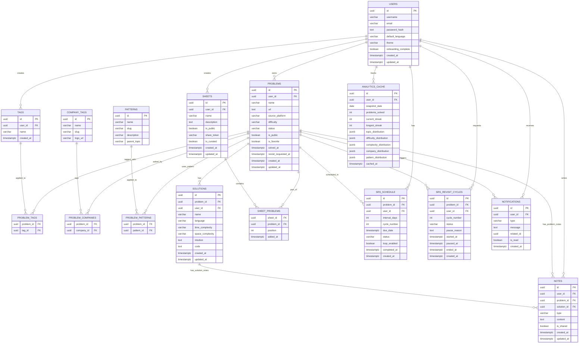

---

## 5. Data Models — Field-Level Specification

### 5.1 `users`

| Column | Type | Constraints | Notes |
|---|---|---|---|
| `id` | `uuid` | PK, default `gen_random_uuid()` | Stable identifier |
| `username` | `varchar(32)` | NOT NULL, UNIQUE | Alphanumeric + underscore only; min 3 chars |
| `email` | `varchar(255)` | UNIQUE, nullable | Optional at signup |
| `password_hash` | `text` | NOT NULL | bcrypt / argon2id, never stored plain |
| `default_language` | `varchar(32)` | NOT NULL, default `'python'` | Set at onboarding; drives Monaco default |
| `theme` | `varchar(8)` | NOT NULL, default `'system'` | `light` \| `dark` \| `system` |
| `onboarding_complete` | `boolean` | NOT NULL, default `false` | Flipped after language selection |
| `created_at` | `timestamptz` | NOT NULL, default `NOW()` | — |
| `updated_at` | `timestamptz` | NOT NULL, default `NOW()` | Trigger auto-updates on row change |

### 5.2 `problems`

| Column | Type | Constraints | Notes |
|---|---|---|---|
| `id` | `uuid` | PK | — |
| `user_id` | `uuid` | FK → users.id, ON DELETE CASCADE | Owner |
| `name` | `varchar(256)` | NOT NULL | Trimmed on write |
| `url` | `text` | Nullable | External OJ link |
| `source_platform` | `varchar(32)` | Nullable | Auto-detected from URL: `leetcode` \| `codeforces` \| `hackerrank` \| `gfg` \| `other` |
| `difficulty` | `varchar(8)` | NOT NULL | `easy` \| `medium` \| `hard` |
| `status` | `varchar(10)` | NOT NULL, default `'unsolved'` | `unsolved` \| `solved` — auto-set on first solution |
| `is_public` | `boolean` | NOT NULL, default `false` | Required `true` for sheet sharing |
| `is_favorite` | `boolean` | NOT NULL, default `false` | Star toggle |
| `solved_at` | `timestamptz` | Nullable | Populated when first solution added |
| `revisit_requested_at` | `timestamptz` | Nullable | Set when user requests a new revisit cycle post-30d |
| `created_at` | `timestamptz` | NOT NULL, default `NOW()` | — |
| `updated_at` | `timestamptz` | NOT NULL | — |

### 5.3 `tags`

| Column | Type | Constraints | Notes |
|---|---|---|---|
| `id` | `uuid` | PK | — |
| `user_id` | `uuid` | FK → users.id, ON DELETE CASCADE | Tags are user-scoped |
| `name` | `varchar(64)` | NOT NULL | **Always lowercase**, trimmed on write |

> **Uniqueness:** `UNIQUE(user_id, name)` prevents duplicate tags per user.

### 5.4 `problem_tags` (junction)

| Column | Type | Constraints |
|---|---|---|
| `problem_id` | `uuid` | FK → problems.id, ON DELETE CASCADE |
| `tag_id` | `uuid` | FK → tags.id, ON DELETE CASCADE |

> **PK:** Composite `(problem_id, tag_id)`

### 5.5 `solutions`

| Column | Type | Constraints | Notes |
|---|---|---|---|
| `id` | `uuid` | PK | — |
| `problem_id` | `uuid` | FK → problems.id, ON DELETE CASCADE | — |
| `user_id` | `uuid` | FK → users.id | Denormalized for direct queries |
| `name` | `varchar(128)` | NOT NULL | e.g. "Two-pointer optimized" |
| `language` | `varchar(32)` | NOT NULL | e.g. `python`, `typescript`, `java` |
| `time_complexity` | `varchar(32)` | NOT NULL | `O(n)`, `O(n log n)`, custom etc. |
| `space_complexity` | `varchar(32)` | NOT NULL | Same range |
| `intuition` | `text` | Nullable | Markdown supported |
| `code` | `text` | NOT NULL | Raw source code |
| `created_at` | `timestamptz` | NOT NULL | — |
| `updated_at` | `timestamptz` | NOT NULL | — |

### 5.6 `sheets`

| Column | Type | Constraints | Notes |
|---|---|---|---|
| `id` | `uuid` | PK | — |
| `user_id` | `uuid` | FK → users.id, ON DELETE CASCADE | — |
| `name` | `varchar(128)` | NOT NULL | — |
| `description` | `text` | Nullable | — |
| `is_public` | `boolean` | NOT NULL, default `false` | Share only if ALL problems in sheet are also public |
| `share_token` | `varchar(32)` | UNIQUE, nullable | Random token, set when first made public |
| `created_at` / `updated_at` | `timestamptz` | NOT NULL | — |

### 5.7 `srs_schedule`

| Column | Type | Constraints | Notes |
|---|---|---|---|
| `id` | `uuid` | PK | — |
| `problem_id` | `uuid` | FK → problems.id, ON DELETE CASCADE | — |
| `user_id` | `uuid` | FK → users.id | Denormalized for direct queue fetch |
| `interval_days` | `smallint` | NOT NULL | `3`, `7`, `15`, or `30` |
| `cycle_number` | `smallint` | NOT NULL, default `1` | 1 = first SRS cycle; 2 = first revisit cycle; etc. |
| `due_date` | `timestamptz` | NOT NULL | `cycle_start_date + interval_days` |
| `status` | `varchar(12)` | NOT NULL, default `'pending'` | `pending` \| `completed` \| `skipped` \| `paused` |
| `loop_enabled` | `boolean` | NOT NULL, default `false` | If true, auto-restart cycle after 30-day completion |
| `completed_at` | `timestamptz` | Nullable | — |
| `created_at` | `timestamptz` | NOT NULL | — |

### 5.8 `srs_revisit_cycles`

Tracks each explicit post-30d revisit cycle initiated by the user, separate from the automatic loop. A revisit is only created on user request and only applies once the 30-day interval is genuinely complete.

| Column | Type | Constraints | Notes |
|---|---|---|---|
| `id` | `uuid` | PK | — |
| `problem_id` | `uuid` | FK → problems.id, ON DELETE CASCADE | — |
| `user_id` | `uuid` | FK → users.id | — |
| `cycle_number` | `smallint` | NOT NULL | Increments: 2, 3, 4 … |
| `status` | `varchar(12)` | NOT NULL, default `'active'` | `active` \| `paused` \| `ended` |
| `pause_reason` | `text` | Nullable | User-provided reason for pausing |
| `started_at` | `timestamptz` | NOT NULL | When revisit was requested |
| `paused_at` | `timestamptz` | Nullable | When user paused this cycle |
| `ended_at` | `timestamptz` | Nullable | When user explicitly ended this cycle |
| `created_at` | `timestamptz` | NOT NULL | — |

> **Revisit Rules:**  
> 1. Revisit is only available after the 30-day interval is marked `completed` in `srs_schedule`.  
> 2. User sees "Request Revisit" button — clicking creates a row in `srs_revisit_cycles` + 4 new `srs_schedule` rows with `cycle_number = N+1`.  
> 3. User can **Pause** a revisit cycle mid-way (e.g. "I'm travelling"). Sets `status='paused'` + `paused_at`. The pending Redis entries are removed; they re-enqueue on resume.  
> 4. User can **End** (archive) a revisit at any time. Sets `status='ended'` + `ended_at`. No further reminders for this cycle.  
> 5. Only one active revisit cycle per problem at a time (`UNIQUE(problem_id, user_id)` where `status='active'`).


| Column | Type | Constraints | Notes |
|---|---|---|---|
| `id` | `uuid` | PK | — |
| `user_id` | `uuid` | FK → users.id, ON DELETE CASCADE | — |
| `type` | `varchar(24)` | NOT NULL | `srs_due` \| `streak_milestone` \| `loop_complete` |
| `message` | `text` | NOT NULL | — |
| `related_id` | `uuid` | Nullable | FK to problem or sheet (polymorphic, not enforced) |
| `is_read` | `boolean` | NOT NULL, default `false` | — |
| `created_at` | `timestamptz` | NOT NULL | — |

### 5.9 `analytics_cache`

| Column | Type | Notes |
|---|---|---|
| `user_id` | `uuid` | FK → users.id |
| `snapshot_date` | `date` | One row per user per day |
| `problems_solved` | `int` | Cumulative count |
| `current_streak` | `int` | Days active in a row |
| `longest_streak` | `int` | All-time best |
| `topic_distribution` | `jsonb` | `{"arrays": 12, "dp": 8, ...}` |
| `difficulty_distribution` | `jsonb` | `{"easy": 10, "medium": 22, "hard": 5}` |
| `complexity_distribution` | `jsonb` | `{"time": {"O(n)": 18, ...}, "space": {...}}` |
| `company_distribution` | `jsonb` | `{"google": 8, "amazon": 5, ...}` |
| `pattern_distribution` | `jsonb` | `{"sliding_window": 10, "bfs": 6, ...}` |
| `cached_at` | `timestamptz` | Refresh trigger on problem solve/update |

> **PK:** `(user_id, snapshot_date)` — one snapshot per user per day.

---

### 5.10 `notes`

Notes exist at two levels: **problem-level** (strategic thoughts about a problem overall) and **solution-level** (annotation on a specific solution). Exactly one of `problem_id` or `solution_id` must be non-null (enforced via DB CHECK constraint). Notes are shared publicly only if the parent problem is public AND `is_shared=true`.

**Note Types — Visual Differentiation:**

| Type | Icon | Border | Background | Use Case |
|---|---|---|---|---|
| `note` | 📝 | Blue `#3B82F6` | `blue-50 / blue-950` | General observation, approach idea |
| `warning` | ⚠️ | Amber `#F59E0B` | `amber-50 / amber-950` | Edge case, common mistake, constraint to watch |
| `success` | ✅ | Green `#22C55E` | `green-50 / green-950` | "Passed!"; key insight that unlocked the problem |
| `error` | ❌ | Red `#EF4444` | `red-50 / red-950` | TLE/MLE approach; what NOT to do |

| Column | Type | Constraints | Notes |
|---|---|---|---|
| `id` | `uuid` | PK | — |
| `user_id` | `uuid` | FK → users.id, ON DELETE CASCADE | Author |
| `problem_id` | `uuid` | FK → problems.id, ON DELETE CASCADE, Nullable | Set for problem-level notes |
| `solution_id` | `uuid` | FK → solutions.id, ON DELETE CASCADE, Nullable | Set for solution-level notes |
| `type` | `varchar(10)` | NOT NULL, default `'note'` | `note` \| `warning` \| `success` \| `error` |
| `content` | `text` | NOT NULL | Markdown supported; sanitized with DOMPurify on render |
| `is_shared` | `boolean` | NOT NULL, default `false` | Visible to public viewers if parent problem is public |
| `created_at` | `timestamptz` | NOT NULL | — |
| `updated_at` | `timestamptz` | NOT NULL | — |

```sql
ALTER TABLE notes ADD CONSTRAINT notes_parent_check
  CHECK (
    (problem_id IS NOT NULL AND solution_id IS NULL) OR
    (problem_id IS NULL  AND solution_id IS NOT NULL)
  );
CREATE INDEX idx_notes_problem  ON notes(problem_id, created_at) WHERE problem_id IS NOT NULL;
CREATE INDEX idx_notes_solution ON notes(solution_id, created_at) WHERE solution_id IS NOT NULL;
```

---

### 5.11 `company_tags` + `problem_companies`

Global pre-seeded list. Not user-scoped. Users attach companies to their own problems.

| Column | Type | Notes |
|---|---|---|
| `id` | `uuid` | PK |
| `name` | `varchar(64)` | e.g. `Google`, `Amazon` |
| `slug` | `varchar(64)` | URL-safe lowercase, e.g. `google` |
| `logo_url` | `text` | CDN URL for company favicon/icon |

**`problem_companies`** junction: composite PK `(problem_id, company_id)`, both FK ON DELETE CASCADE.

**55+ seeded companies:** Google, Amazon, Meta, Apple, Microsoft, Netflix, Uber, Airbnb, LinkedIn, Twitter/X, Stripe, Dropbox, Snapchat, Pinterest, Salesforce, Adobe, Oracle, SAP, Cisco, Intel, Nvidia, Qualcomm, Atlassian, Shopify, Spotify, PayPal, Square/Block, Robinhood, DoorDash, Lyft, Coinbase, Databricks, Snowflake, MongoDB, Palantir, Twilio, Zoom, Slack, Okta, ServiceNow, Workday, Intuit, HubSpot, Zendesk, Goldman Sachs, JPMorgan, Morgan Stanley, Two Sigma, Jane Street, Citadel, Optiver, DE Shaw, Quora, Reddit, ByteDance/TikTok.

---

### 5.12 `patterns` + `problem_patterns`

Predefined global patterns. Users assign these to problems. Not user-created.

| Column | Type | Notes |
|---|---|---|
| `id` | `uuid` | PK |
| `name` | `varchar(64)` | e.g. `Sliding Window` |
| `slug` | `varchar(64)` | e.g. `sliding-window` |
| `description` | `text` | One-line explanation |
| `parent_topic` | `varchar(64)` | Broad domain: `Arrays`, `Graphs`, `DP`, etc. |

> **Topic Tags vs Pattern Tags — clarified:**  
> Topic tags (user-created, lowercase, e.g. `arrays`, `graphs`) describe the *data structure domain* of the problem — **what data is involved**.  
> Pattern tags (global, predefined) describe the *algorithmic technique* — **how it is solved**.  
> They complement each other: an `arrays` problem can be solved with a `Sliding Window` pattern. The UI shows both on separate rows in the Problem Detail Modal. Filtering supports both independently.

**Seeded patterns:**

| Pattern | Parent Topic | Pattern | Parent Topic |
|---|---|---|---|
| Sliding Window | Arrays | Two Pointers | Arrays |
| Fast & Slow Pointers | Linked Lists | Merge Intervals | Arrays |
| BFS | Graphs/Trees | DFS | Graphs/Trees |
| Backtracking | Recursion | Dynamic Programming | DP |
| 0/1 Knapsack | DP | Unbounded Knapsack | DP |
| Fibonacci Sequence | DP | Palindromic Subsequence | DP/Strings |
| Tree BFS | Trees | Tree DFS | Trees |
| Two Heaps | Heaps | Top K Elements | Heaps |
| Monotonic Stack | Stacks | Topological Sort | Graphs |
| Union Find | Graphs | Trie | Strings |
| Binary Search | Arrays | Prefix Sum | Arrays |
| Greedy | Greedy | Divide & Conquer | Recursion |
| Bit Manipulation | Bits | Cyclic Sort | Arrays |

**`problem_patterns`** junction: composite PK `(problem_id, pattern_id)`, both FK ON DELETE CASCADE.

---

## 6. API Endpoint Catalog

All authenticated endpoints require a valid iron-session cookie. Responses follow `{ data, error, meta }` envelope. All timestamps in responses are formatted as `dd-MON-yyyy HH:mm IST`.

### Auth

| Method | Path | Auth | Description |
|---|---|---|---|
| `POST` | `/api/auth/signup` | No | Create account. Returns session cookie. |
| `POST` | `/api/auth/login` | No | Validates credentials. Sets cookie. |
| `POST` | `/api/auth/logout` | Yes | Destroys session. |
| `PATCH` | `/api/users/me` | Yes | Update `default_language`, theme, `onboarding_complete`. |

### Problems

| Method | Path | Auth | Description |
|---|---|---|---|
| `GET` | `/api/problems` | Yes | List problems. Supports: `?q=`, `?difficulty=`, `?tag=`, `?company=`, `?pattern=`, `?status=`, `?cursor=`, `?limit=` |
| `POST` | `/api/problems` | Yes | Create problem. Auto-creates topic tags. Accepts `company_ids[]`, `pattern_ids[]`. |
| `GET` | `/api/problems/:id` | Yes | Problem + solutions + tags + companies + patterns + notes + SRS timeline. |
| `PATCH` | `/api/problems/:id` | Yes | Update name, url, difficulty, is_public, is_favorite. |
| `DELETE` | `/api/problems/:id` | Yes | Cascade deletes solutions, tags, SRS schedules, notes. |
| `GET` | `/api/problems/:id/solutions` | Yes | All solutions with their notes. |
| `POST` | `/api/problems/:id/solutions` | Yes | Add solution → triggers SRS init if first solution. |
| `PATCH` | `/api/problems/:id/solutions/:sId` | Yes | Update solution fields. |
| `DELETE` | `/api/problems/:id/solutions/:sId` | Yes | Remove solution + its notes. |

### Notes

| Method | Path | Auth | Description |
|---|---|---|---|
| `GET` | `/api/problems/:id/notes` | Yes | All problem-level notes for a problem. |
| `POST` | `/api/problems/:id/notes` | Yes | Create problem-level note. Body: `{ type, content, is_shared }`. |
| `GET` | `/api/problems/:id/solutions/:sId/notes` | Yes | All solution-level notes. |
| `POST` | `/api/problems/:id/solutions/:sId/notes` | Yes | Create solution-level note. |
| `PATCH` | `/api/notes/:id` | Yes | Edit note content, type, or is_shared. |
| `DELETE` | `/api/notes/:id` | Yes | Delete note (owner only). |

### Company Tags

| Method | Path | Auth | Description |
|---|---|---|---|
| `GET` | `/api/company-tags` | No | List all 55+ global companies. Used to populate CompanyTagSelector. |
| `POST` | `/api/problems/:id/companies` | Yes | Attach companies to a problem. Body: `{ company_ids: string[] }`. |
| `DELETE` | `/api/problems/:id/companies/:cId` | Yes | Remove a company from a problem. |

### Pattern Tags

| Method | Path | Auth | Description |
|---|---|---|---|
| `GET` | `/api/patterns` | No | List all predefined patterns, grouped by parent topic. |
| `POST` | `/api/problems/:id/patterns` | Yes | Attach pattern(s) to a problem. Body: `{ pattern_ids: string[] }`. |
| `DELETE` | `/api/problems/:id/patterns/:pId` | Yes | Remove a pattern from a problem. |

### Topic Tags

| Method | Path | Auth | Description |
|---|---|---|---|
| `GET` | `/api/tags` | Yes | Get all user topic tags. Supports `?prefix=` for autocomplete. |
| `POST` | `/api/tags` | Yes | Create tag (lowercase-forced). |

### Sheets

| Method | Path | Auth | Description |
|---|---|---|---|
| `GET` | `/api/sheets` | Yes | List user's sheets (includes curated sheets). |
| `POST` | `/api/sheets` | Yes | Create sheet. |
| `GET` | `/api/sheets/:id` | Yes | Sheet detail with problem list. |
| `PATCH` | `/api/sheets/:id` | Yes | Update name, description, is_public (validates all problems are public). |
| `DELETE` | `/api/sheets/:id` | Yes | Delete non-curated sheet. Curated sheets can only be forked, not deleted. |
| `POST` | `/api/sheets/:id/problems` | Yes | Add problem to sheet. |
| `DELETE` | `/api/sheets/:id/problems/:pId` | Yes | Remove problem from sheet. |
| `POST` | `/api/sheets/:id/fork` | Yes | Fork a curated sheet into user's own sheets. |
| `GET` | `/api/s/:shareToken` | No | Public sheet read (problems + solutions + shared notes). |

### SRS

| Method | Path | Auth | Description |
|---|---|---|---|
| `GET` | `/api/srs/queue` | Yes | Fetch problems due for review. Checks Redis sorted set first. |
| `POST` | `/api/srs/:scheduleId/complete` | Yes | Mark interval reviewed. Queues next interval or loops. |
| `GET` | `/api/srs/:problemId/timeline` | Yes | Full SRS timeline for a problem: all cycles, intervals, statuses, dates formatted in IST. |
| `POST` | `/api/srs/:problemId/revisit` | Yes | Request a new revisit cycle (only if 30d interval is completed). Creates `srs_revisit_cycles` row + 4 new schedule rows. |
| `POST` | `/api/srs/:problemId/pause` | Yes | Pause active revisit cycle. Body: `{ reason?: string }`. Removes pending Redis entries. |
| `POST` | `/api/srs/:problemId/resume` | Yes | Resume a paused revisit cycle. Re-enqueues remaining intervals in Redis. |
| `POST` | `/api/srs/:problemId/end` | Yes | Permanently end/archive the active revisit cycle. |

### Notifications

| Method | Path | Auth | Description |
|---|---|---|---|
| `GET` | `/api/notifications` | Yes | All notifications. `?unread=true` for count badge. |
| `PATCH` | `/api/notifications/:id/read` | Yes | Mark single notification read. |
| `PATCH` | `/api/notifications/read-all` | Yes | Mark all as read. |

### Analytics

| Method | Path | Auth | Description |
|---|---|---|---|
| `GET` | `/api/analytics` | Yes | Full analytics payload. Returns cached snapshot, regenerates if stale (> 1 hour). |

---

## 7. UI/UX Layout Specification

### 7.1 Landing Page

**Route:** `/`  
**Auth:** None required

**Layout (single-page scroll):**

```
┌─────────────────────────────────────────────┐
│  NAVBAR (sticky, 64px)                       │
│  [⚡ CodeVault logo]          [☀/🌙 Toggle]  │
├─────────────────────────────────────────────┤
│  HERO (100vh, gradient mesh background)      │
│                                             │
│         ⚡ CodeVault                         │
│  Track · Solve · Remember · Master          │
│                                             │
│   [  Sign Up  ]   [  How it works?  ]       │
│                                             │
│    (subtle animated grid / noise texture)   │
├─────────────────────────────────────────────┤
│  ABOUT (2-col: text left, mockup right)      │
├─────────────────────────────────────────────┤
│  FEATURES (3-col card grid, 6 cards)         │
│  [Problem Tracking] [Multi-Solution] [SRS]  │
│  [Analytics]  [Public Sharing]  [Sheets]    │
├─────────────────────────────────────────────┤
│  HOW IT WORKS (numbered steps, icon+text)   │
│  1 → Add a problem  2 → Write solution      │
│  3 → SRS auto-starts  4 → Review when due   │
├─────────────────────────────────────────────┤
│  MEMORY CURVE (animated SRS timeline viz)   │
│  Day 0 ──3d──7d──15d──30d → Mastered ✓      │
├─────────────────────────────────────────────┤
│  FOOTER (logo, nav links, dark/light)        │
└─────────────────────────────────────────────┘
```

- Background: Animated gradient mesh (CSS `@keyframes` or Three.js canvas)  
- Hero typography: Display font (e.g. `Sora` or `Cabinet Grotesk`), 72px desktop / 40px mobile  
- Buttons: "Sign Up" = filled accent, "How it works" = ghost outline  
- Feature cards: Glass-morphism cards with icon + title + 2-line description  
- SRS timeline viz: SVG curve showing forgetting curve with review points marked  

---

### 7.2 Auth Pages

**Routes:** `/login`, `/signup`  
**Layout:** Centered card on split background (left: brand graphic, right: form)

```
┌──────────────────────────────────────────────────┐
│  [← Back to CodeVault]           [☀/🌙 Toggle]   │
│                                                  │
│  ┌────────────────────┐  ┌────────────────────┐  │
│  │                    │  │  Sign Up            │  │
│  │   Brand graphic /  │  │                     │  │
│  │   tagline + SRS    │  │  Username*          │  │
│  │   timeline art     │  │  [_______________]  │  │
│  │                    │  │                     │  │
│  │                    │  │  Email (optional)   │  │
│  │                    │  │  [_______________]  │  │
│  │                    │  │                     │  │
│  │                    │  │  Password*          │  │
│  │                    │  │  [_______________]  │  │
│  │                    │  │                     │  │
│  │                    │  │  [  Create Account] │  │
│  │                    │  │                     │  │
│  │                    │  │  Already have one?  │  │
│  │                    │  │  Log in →           │  │
│  └────────────────────┘  └────────────────────┘  │
└──────────────────────────────────────────────────┘
```

- Inline Zod validation with error messages below each field  
- Password strength indicator (entropy bar)  
- On successful signup: redirect to `/problems` → `onboarding_complete=false` triggers language modal  

---

### 7.3 Dashboard Shell (Authenticated Layout)

```
┌──────────────────────────────────────────────────────────────────┐
│  SIDEBAR (240px, collapsible → icon rail on tablet)              │
│  ┌────────────────┐  ┌───────────────────────────────────────┐   │
│  │ ⚡ CodeVault   │  │ TOP BAR (60px)                         │   │
│  │                │  │  [Page Title]    🔔(n)  [☀/🌙] [👤]   │   │
│  │ 📋 Problems    │  ├───────────────────────────────────────┤   │
│  │ 📁 Sheets      │  │                                        │   │
│  │ 📊 Analytics   │  │          MAIN CONTENT AREA             │   │
│  │                │  │          (scrollable, flex-1)          │   │
│  │   ─────────    │  │                                        │   │
│  │ ⚙  Settings   │  │                                        │   │
│  │ ↪  Logout      │  │                                        │   │
│  └────────────────┘  └───────────────────────────────────────┘   │
└──────────────────────────────────────────────────────────────────┘
```

**Mobile behavior:**  
- Sidebar collapses to a hamburger icon in the TopBar  
- Drawer slide-in on hamburger tap (overlay)  
- Bottom navigation bar alternative for mobile (Problems / Sheets / Analytics)  

---

### 7.4 Problems Tab

```
┌────────────────────────────────────────────────────────┐
│  [🔍 Search problems...] [⊞ Filters ▼]  [+ Add Problem]│
├────────────────────────────────────────────────────────┤
│  DIFFICULTY │ PROBLEM NAME           │ TAGS    │ ACTIONS│
│  ──────────────────────────────────────────────────────│
│  🟢 Easy    │ Two Sum                │ arrays  │ 👁 ⭐ ✏ 🗑│
│  🟡 Medium  │ Longest Substring...   │ sliding │ 👁 ⭐ ✏ 🗑│
│  🔴 Hard    │ Trapping Rain Water    │ arrays  │ 👁 ⭐ ✏ 🗑│
│  ...                                                   │
│  (virtualized — renders 20 visible rows at a time)     │
├────────────────────────────────────────────────────────┤
│  Showing 1-20 of 347  [← Prev]  [1] [2] ... [Next →]  │
└────────────────────────────────────────────────────────┘
```

**Filters dropdown:**  
Multi-select panel with two sections:  
- **Topic:** checkboxes for all user tags  
- **Difficulty:** Easy / Medium / Hard toggles  
- **Status:** Solved / Unsolved toggles  

**Mobile fallback:**  
Table collapses to stacked cards:
```
┌──────────────────────────┐
│ 🟢 Easy                  │
│ Two Sum                  │
│ #arrays #hashtable       │
│ [View] [⭐] [Edit] [🗑]  │
└──────────────────────────┘
```

---

### 7.5 Add Problem Modal

```
┌──────────────────────────────────────────────────────────┐
│  Track New Problem                                    [×] │
│                                                          │
│  Problem URL  (paste first — auto-fills fields below)    │
│  [https://leetcode.com/problems/two-sum/            🔗]  │
│  ✅ Detected: LeetCode · Difficulty: Easy · Name filled  │
│                                                          │
│  Problem Name*                                           │
│  [Two Sum                                           ]    │
│                                                          │
│  Difficulty*                                             │
│  [ 🟢 Easy ] [ 🟡 Medium ] [ 🔴 Hard ]                  │
│                                                          │
│  Topic Tags  (free-form, lowercase, user-created)        │
│  [arrays ×] [hashtable ×]  [+ type to add...]           │
│                                                          │
│  Pattern Tags  (algorithmic approach — predefined)       │
│  [Two Pointers ×]  [+ select pattern...]                 │
│                                                          │
│  Company Tags  (optional)                                │
│  [🔵 Google ×] [🟠 Amazon ×]  [+ add company...]        │
│                                                          │
│  Public                                                  │
│  ○──────● (toggle)                                       │
│                                                          │
│  [  Cancel  ]                      [  Add Problem →  ]   │
└──────────────────────────────────────────────────────────┘
```

- **URL auto-detect:** On blur/paste, server-side scraper infers `source_platform`, pre-fills `name`, `difficulty`, and `topic tags` from LeetCode/Codeforces/GFG. User can override all.
- Topic tags: typeahead autocomplete from user's existing tags, create on Enter, forced lowercase.
- Pattern tags: modal dropdown with patterns grouped by parent topic.
- Company tags: searchable dropdown from global 55+ company list with logo icons.
- Difficulty: segmented control with green/amber/red active states.
- On submit: modal closes → Problem Detail Modal opens immediately.

---

### 7.6 Problem Detail Modal

```
┌───────────────────────────────────────────────────────────────────┐
│  Two Sum                                       [🔗] [⭐] [✏] [×] │
│  🟢 Easy  · #arrays #hashtable  · 🔁 Sliding Window, Two Pointers│
│  🏢 Google  Amazon  Meta                                          │
│  Added: 05-JUN-2026 10:30 IST  ·  Solved: 05-JUN-2026 11:00 IST  │
│  ─────────────────────────────────────────────────────────────────│
│                                                                   │
│  ━━━ SRS REVISIT TIMELINE ━━━━━━━━━━━━━━━━━━━━━━━━━━━━━━━━━━━━   │
│                                                                   │
│  Cycle 1 (Current)                                               │
│  [✅ Solved]──[✅ 3d]──[✅ 7d]──[⏳ 15d]──[· 30d]               │
│  05-JUN      08-JUN   12-JUN   20-JUN ←due  05-JUL              │
│                       ↑ reviewed      ↑ next review in 8d        │
│                                                                   │
│  Post-30d:  [ Request Revisit Cycle ]  (available after 30d done) │
│                                                                   │
│  If revisit active:                                               │
│  Cycle 2  [ ⏸ Pause Revisit ]  [ ⏹ End Revisit ]               │
│  [🔵 Active]──[· 3d]──[· 7d]──[· 15d]──[· 30d]                  │
│  ─────────────────────────────────────────────────────────────────│
│                                                                   │
│  ━━━ SOLUTIONS (2)  ━━━━━━━━━━━━━━━━━━━━━  [+ Add Solution]  ━━  │
│                                                                   │
│  ┌─────────────────────────────────────────────────────────────┐  │
│  │  Brute Force              🐍 Python    O(n²) / O(1)        │  │
│  │  Added: 05-JUN-2026 11:00 IST          [View Code] [🗑]    │  │
│  │                                                             │  │
│  │  ── Solution Notes (1) ──────────────────────────────────  │  │
│  │  ❌ error  "TLEs on inputs > 10^4. Don't use this."        │  │
│  │                              [+ Add Solution Note]          │  │
│  └─────────────────────────────────────────────────────────────┘  │
│                                                                   │
│  ┌─────────────────────────────────────────────────────────────┐  │
│  │  HashMap Approach         🐍 Python    O(n) / O(n)         │  │
│  │  Added: 05-JUN-2026 11:15 IST          [View Code] [🗑]    │  │
│  │                                                             │  │
│  │  ── Solution Notes (2) ──────────────────────────────────  │  │
│  │  ✅ success  "Optimal. complement = target - num trick."    │  │
│  │  ⚠️ warning  "Watch out: nums can have duplicates."        │  │
│  │                              [+ Add Solution Note]          │  │
│  └─────────────────────────────────────────────────────────────┘  │
│                                                                   │
│  ━━━ PROBLEM NOTES (2)  ━━━━━━━━━━━━━━━━━━━━━━━━━  [+ Add Note]  │
│                                                                   │
│  📝 note    "Classic two-pass trick with hashmap is the pattern." │
│             05-JUN-2026 11:20 IST  [👁 shared]  [✏] [🗑]         │
│                                                                   │
│  ⚠️ warning  "Edge: empty array, single element — handle them."   │
│             05-JUN-2026 12:00 IST  [🔒 private] [✏] [🗑]         │
└───────────────────────────────────────────────────────────────────┘
```

**SRS Timeline rules:**
- Each dot `[·]` = pending interval, `[✅]` = completed, `[⏳]` = due now/overdue, `[⏸]` = paused
- Dates shown in `dd-MON-yyyy` format (IST)
- "Request Revisit Cycle" only enabled after the 30-day interval of the current cycle is `completed`
- Revisit cycle controls (Pause/End) only visible when an active revisit cycle exists
- Pause requires optional reason text; End asks for confirmation

**Notes panel rules:**
- Problem notes appear below all solutions
- Solution notes appear inline within each solution card
- Note type rendered with colour-coded left border + icon
- `is_shared` toggle (👁/🔒) on each note — shared notes appear in public view
- Public viewers see: shared problem notes + shared solution notes (only if parent problem is public)

---

### 7.7 Add / View Solution Modal (Monaco Editor embedded)

```
┌───────────────────────────────────────────────────────────────┐
│  Add Solution                                             [×]  │
│                                                               │
│  Solution Name*          Language*                            │
│  [HashMap Approach    ]  [🐍 Python ▼] ← default_language     │
│                                                               │
│  Time Complexity             Space Complexity                 │
│  [O(n)            ▼]         [O(n)            ▼]             │
│  predefined: O(1) O(log n) O(n) O(n log n) O(n²) custom      │
│                                                               │
│  Intuition & Approach (Markdown)                              │
│  ┌─────────────────────────────────────────────────────────┐  │
│  │ Use a hashmap to store seen complements...              │  │
│  └─────────────────────────────────────────────────────────┘  │
│                                                               │
│  Code  (Monaco Editor — lazy loaded, theme-synced)            │
│  ┌─────────────────────────────────────────────────────────┐  │
│  │ 1  def twoSum(nums: list[int], target: int):            │  │
│  │ 2      seen = {}                                        │  │
│  │ 3      for i, num in enumerate(nums):                   │  │
│  │ 4          comp = target - num                          │  │
│  │ 5          if comp in seen:                             │  │
│  │ 6              return [seen[comp], i]                   │  │
│  │ 7          seen[num] = i                                │  │
│  └── ↕ drag to resize ──────────────────────────── [copy]─┘  │
│                                                               │
│  ── Solution Notes  ─────────────────────── [+ Add Note] ──   │
│  (Optional notes specific to this solution approach)          │
│                                                               │
│  ┌─ Select type: [📝 Note ▼] ─────────────────────────────┐  │
│  │ [📝 Note] [⚠️ Warning] [✅ Success] [❌ Error]          │  │
│  └─────────────────────────────────────────────────────────┘  │
│  ┌─────────────────────────────────────────────────────────┐  │
│  │ This approach is optimal but fails to handle...         │  │
│  └─────────────────────────────────────────────────────────┘  │
│  Share this note publicly? ○── No  (toggle)                   │
│                                                               │
│  [  Cancel  ]                         [  Save Solution →  ]   │
└───────────────────────────────────────────────────────────────┘
```

Monaco editor: min 240px, max 480px, resizable drag handle at bottom-right.

**View mode (Shiki):** When viewing a saved solution (not editing), the code block uses Shiki for fast, server-rendered highlighted HTML. Monaco only loads on "Edit Solution" click.

```
┌─ View: HashMap Approach — Python ───────────────────────── [Edit]─┐
│  ╔══ Shiki-rendered code block (theme-synced, zero client JS) ══╗ │
│  ║  def twoSum(nums: list[int], target: int):                  ║ │
│  ║      seen = {}                                              ║ │
│  ║      for i, num in enumerate(nums):                         ║ │
│  ║          comp = target - num                                ║ │
│  ║          if comp in seen:                                   ║ │
│  ║              return [seen[comp], i]                         ║ │
│  ║          seen[num] = i                                      ║ │
│  ╚═════════════════════════════════════════════════════════════╝ │
│  [📋 Copy]                                                         │
└────────────────────────────────────────────────────────────────────┘
```

---

### 7.8 Sheets Tab

```
┌─────────────────────────────────────────────────────┐
│  My Sheets                          [+ New Sheet]    │
│                                                     │
│  ┌─────────────────┐ ┌─────────────────┐            │
│  │ Blind 75        │ │ Dynamic Prog    │            │
│  │ 42 problems     │ │ 18 problems     │            │
│  │ 🔓 Public       │ │ 🔒 Private      │            │
│  │ Updated 2d ago  │ │ Updated 5d ago  │            │
│  └─────────────────┘ └─────────────────┘            │
│                                                     │
│  ┌─────────────────┐ ┌─────────────────┐            │
│  │ + New Sheet     │ │                 │            │
│  │   (ghost card)  │ │                 │            │
│  └─────────────────┘ └─────────────────┘            │
└─────────────────────────────────────────────────────┘
```

- Grid: 3 cols desktop, 2 cols tablet, 1 col mobile  
- Sheet card: hover shows "Open", "Share", "Delete" action buttons  
- Making a sheet public: system checks all contained problems are `is_public=true`; if not, shows warning with list of private problems  

---

### 7.9 Analytics Tab

```
┌──────────────────────────────────────────────────────────┐
│  📊 Analytics                                            │
│                                                          │
│  [Total: 85] [Solved: 62] [Streak: 🔥14d] [Best: 21d]   │
│                                                          │
│  ── Activity Heatmap (GitHub-style, 52 weeks) ──────────│
│  [░░▒▒▒▓▓▓▓▓░░░░▒▒▒▒▓▓▓▓▓▓▒░░░░░▒▒▒▒▒▓▓▓▓░░░░▒▒▒▒▒▓▓]  │
│  Jan  Feb  Mar  Apr  May  Jun  Jul ...                   │
│                                                          │
│  ┌──────────────────────┐ ┌──────────────────────────┐  │
│  │  Topic Distribution   │ │  Difficulty Distribution  │  │
│  │  (Donut chart)        │ │  (Horizontal bar chart)   │  │
│  │  Arrays 35%           │ │  🟢 Easy  ██████ 30       │  │
│  │  DP 20%               │ │  🟡 Med   ████████ 24     │  │
│  │  Graphs 15%           │ │  🔴 Hard  ████ 8          │  │
│  │  ...                  │ │                           │  │
│  └──────────────────────┘ └──────────────────────────┘  │
│                                                          │
│  ┌──────────────────────┐ ┌──────────────────────────┐  │
│  │  Time Complexity      │ │  Space Complexity         │  │
│  │  (Bar chart)          │ │  (Bar chart)              │  │
│  └──────────────────────┘ └──────────────────────────┘  │
└──────────────────────────────────────────────────────────┘
```

---

### 7.10 Settings Page

```
┌──────────────────────────────────────────────┐
│  ⚙ Settings                                  │
│                                              │
│  ── Profile ─────────────────────────────   │
│  Username      [soham_codes              ]   │
│  Email         [soham@example.com        ]   │
│                                              │
│  ── Preferences ──────────────────────────  │
│  Default Language  [Python           ▼]      │
│  Theme             [System           ▼]      │
│                                              │
│  ── Notifications ────────────────────────  │
│  SRS Reminders     ●──── On                  │
│  Loop SRS by default ○── Off                 │
│                                              │
│  ── Security ─────────────────────────────  │
│  [Change Password]                           │
│                                              │
│  ── Danger Zone ──────────────────────────  │
│  [Delete Account]  (confirmation required)   │
└──────────────────────────────────────────────┘
```

---

## 8. Full UML Suite

### 8.1 System Architecture

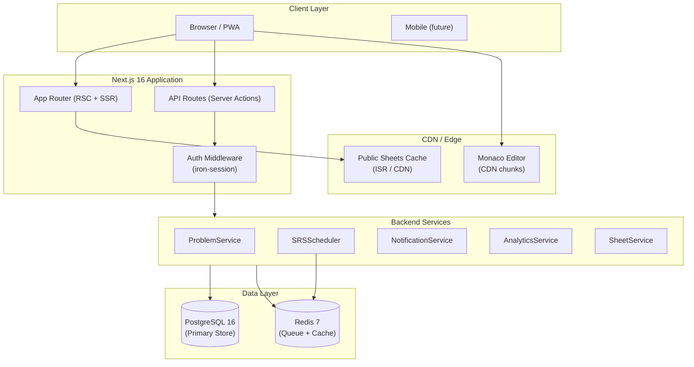

---

### 8.2 Frontend Component Tree

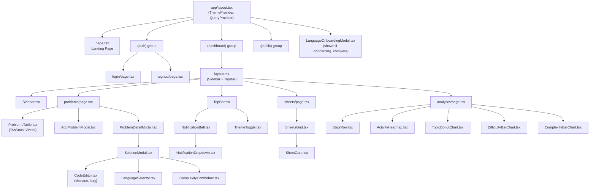

---

### 8.3 Backend Service Class Diagram

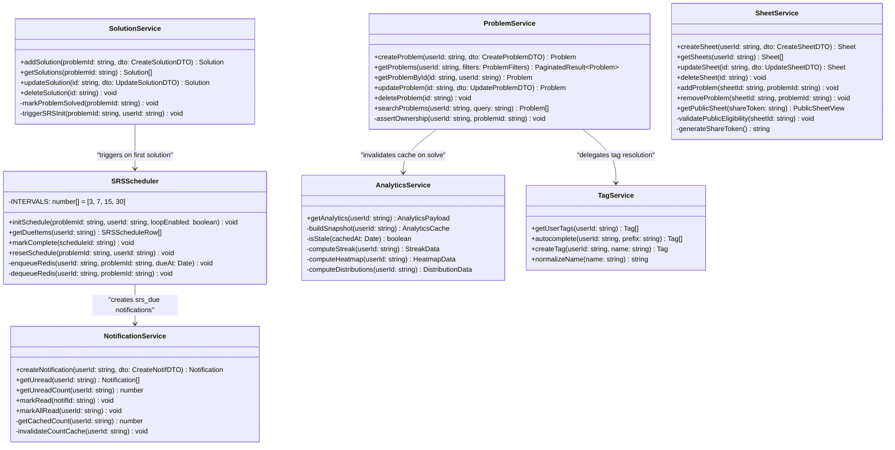

---

### 8.4 Sequence: Auth + Onboarding

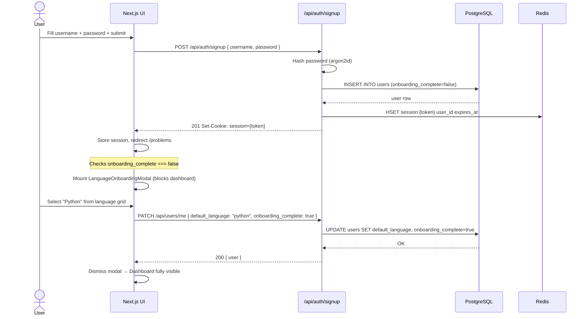

---

### 8.5 Sequence: Add Problem → Solution → SRS Init

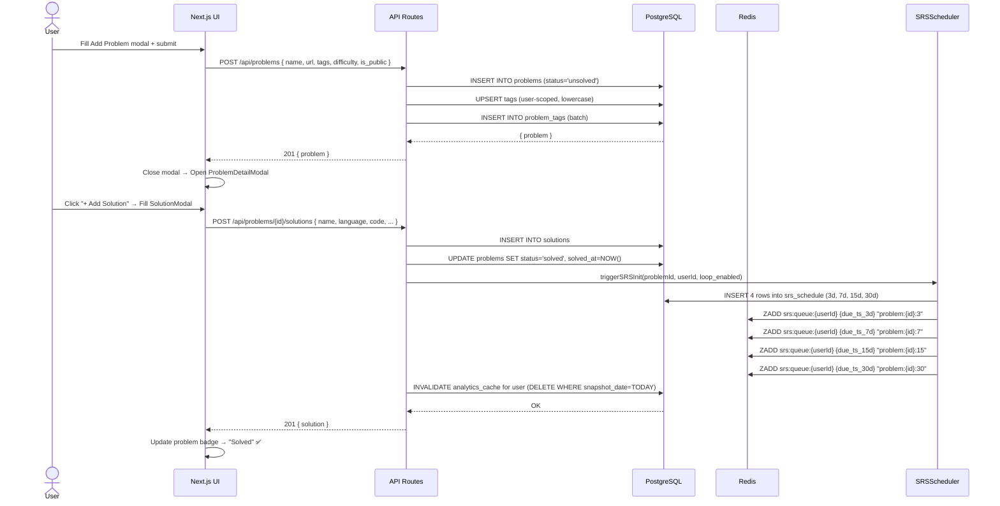

---

### 8.6 Sequence: SRS Notification Polling & Review

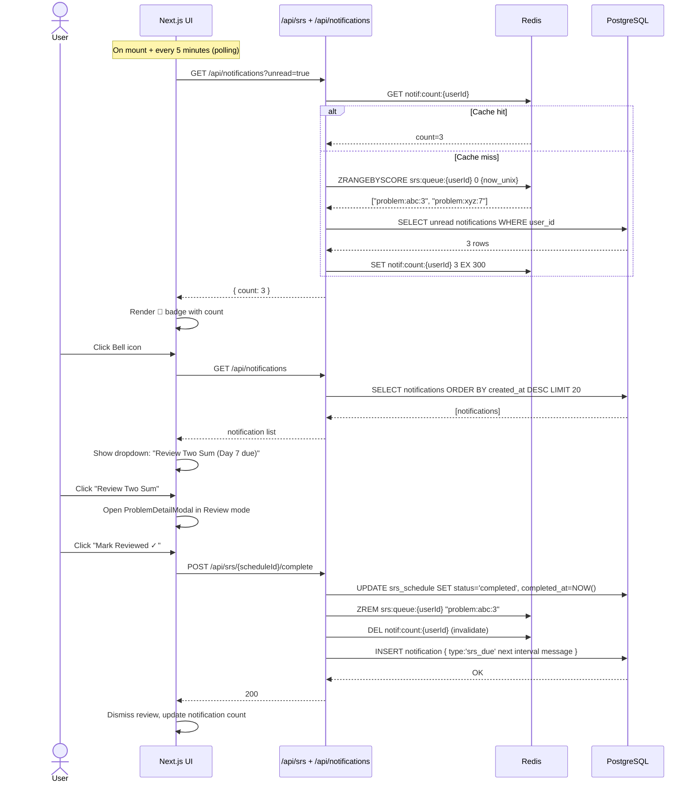

---

### 8.7 Sequence: Public Sheet Access (Cross-user)

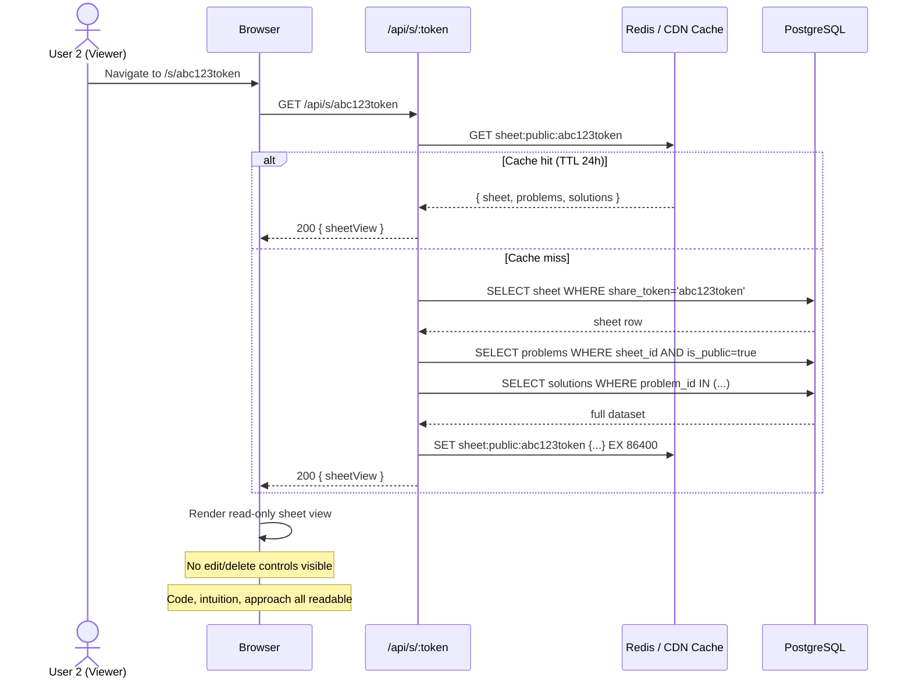

---

### 8.8 Problem Lifecycle State Machine

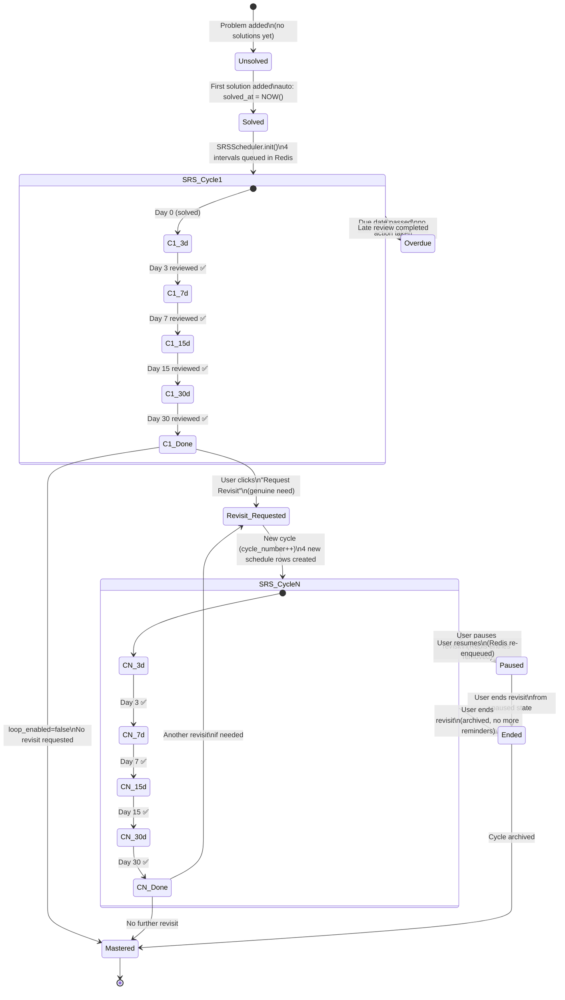

---

### 8.9 SRS Engine Activity Diagram

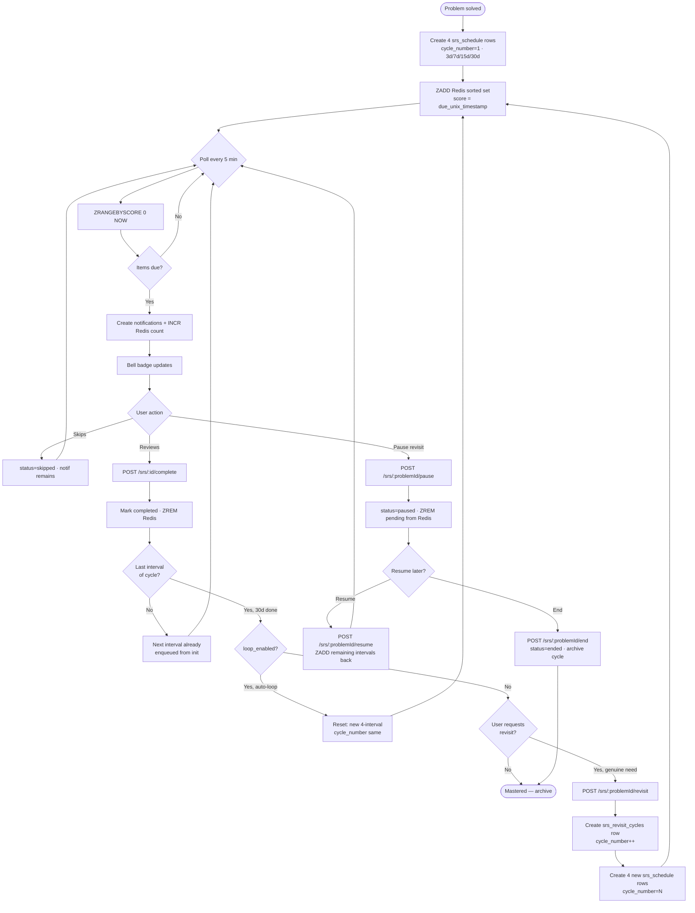

---

### 8.10 Use Case Overview

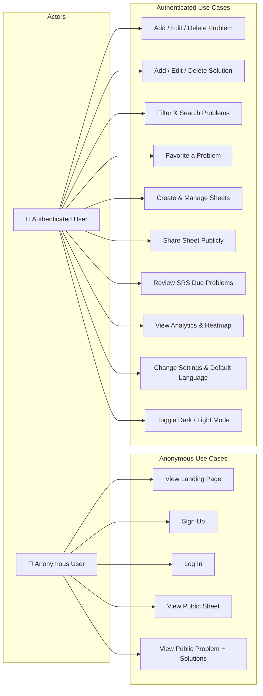

---

## 9. Spaced Repetition Engine — Deep Dive

### 9.1 Interval Logic

```typescript
// lib/srs/scheduler.ts

const SRS_INTERVALS_DAYS = [3, 7, 15, 30] as const;

/**
 * Initializes a full 4-interval SRS schedule for a newly solved problem.
 * Inserts DB rows AND enqueues all 4 entries in Redis sorted set.
 *
 * @param problemId - UUID of the solved problem
 * @param userId    - UUID of the problem owner
 * @param solvedAt  - Timestamp when problem was first solved (default: NOW())
 * @param loop      - Whether to restart the cycle after day-30 completion
 */
async function initSchedule(
  problemId: string,
  userId: string,
  solvedAt: Date = new Date(),
  loop: boolean = false,
): Promise<void> {
  const rows = SRS_INTERVALS_DAYS.map((days) => ({
    id: crypto.randomUUID(),
    problem_id: problemId,
    user_id: userId,
    interval_days: days,
    due_date: addDays(solvedAt, days),   // date-fns addDays
    status: "pending",
    loop_enabled: loop,
    created_at: new Date(),
  }));

  // DB bulk insert (Drizzle)
  await db.insert(srsSchedule).values(rows);

  // Redis: ZADD srs:queue:{userId} {score=unix_ts} {member=scheduleId}
  const redisArgs = rows.flatMap((r) => [
    r.due_date.getTime() / 1000,  // Unix seconds as score
    r.id,
  ]);
  await redis.zadd(`srs:queue:${userId}`, ...redisArgs);
}
```

### 9.2 Redis Queue Operations

```
# Enqueue (on solve)
ZADD srs:queue:{userId} {unix_due_timestamp} {scheduleId}

# Poll due items (every client tick)
ZRANGEBYSCORE srs:queue:{userId} 0 {unix_now}
→ Returns list of scheduleIds whose due_date <= now

# Dequeue on review
ZREM srs:queue:{userId} {scheduleId}

# Peek count without removing
ZCOUNT srs:queue:{userId} 0 {unix_now}
```

### 9.3 Notification Deduplication

A notification is only created once per `(user_id, related_id, type)` per day. Before inserting, check:

```sql
SELECT id FROM notifications
WHERE user_id = $1
  AND related_id = $2
  AND type = 'srs_due'
  AND created_at::date = CURRENT_DATE
LIMIT 1;
```

If exists → skip insert.

---

### 9.4 Post-30d Revisit Cycle Logic

```typescript
// lib/srs/scheduler.ts

/**
 * Initiates a new manual revisit cycle for a problem that has completed its 30-day interval.
 * Only callable when the most recent cycle's 30-day entry is status='completed'.
 *
 * @param problemId  - UUID of the problem
 * @param userId     - UUID of the user requesting the revisit
 */
async function requestRevisit(problemId: string, userId: string): Promise<void> {
  // Guard: ensure 30d interval is genuinely complete
  const last30d = await db.query.srsSchedule.findFirst({
    where: and(
      eq(srsSchedule.problem_id, problemId),
      eq(srsSchedule.interval_days, 30),
      eq(srsSchedule.status, "completed"),
    ),
    orderBy: [desc(srsSchedule.cycle_number)],
  });

  if (!last30d) {
    throw new Error("Revisit only available after completing the 30-day interval.");
  }

  // Guard: no active revisit cycle already running
  const activeRevisit = await db.query.srsRevisitCycles.findFirst({
    where: and(
      eq(srsRevisitCycles.problem_id, problemId),
      eq(srsRevisitCycles.user_id, userId),
      eq(srsRevisitCycles.status, "active"),
    ),
  });
  if (activeRevisit) throw new Error("An active revisit cycle already exists.");

  const nextCycleNumber = last30d.cycle_number + 1;
  const startDate = new Date();

  // 1. Record the revisit cycle
  await db.insert(srsRevisitCycles).values({
    id: crypto.randomUUID(),
    problem_id: problemId,
    user_id: userId,
    cycle_number: nextCycleNumber,
    status: "active",
    started_at: startDate,
    created_at: startDate,
  });

  // 2. Create 4 new schedule rows for the revisit
  await initSchedule(problemId, userId, startDate, false, nextCycleNumber);

  // 3. Update problem.revisit_requested_at
  await db.update(problems)
    .set({ revisit_requested_at: startDate, updated_at: startDate })
    .where(eq(problems.id, problemId));
}

/**
 * Pauses an active revisit cycle. Removes pending Redis queue entries for
 * remaining unreviewed intervals. Optionally captures a pause reason.
 */
async function pauseRevisit(
  problemId: string,
  userId: string,
  reason?: string,
): Promise<void> {
  const cycle = await getActiveRevisitCycle(problemId, userId);

  // Remove all pending schedule entries from Redis
  const pendingIds = await db.query.srsSchedule.findMany({
    where: and(
      eq(srsSchedule.problem_id, problemId),
      eq(srsSchedule.cycle_number, cycle.cycle_number),
      eq(srsSchedule.status, "pending"),
    ),
    columns: { id: true },
  });
  if (pendingIds.length) {
    await redis.zrem(`srs:queue:${userId}`, ...pendingIds.map((r) => r.id));
  }

  // Mark schedule entries as paused
  await db.update(srsSchedule)
    .set({ status: "paused" })
    .where(and(
      eq(srsSchedule.problem_id, problemId),
      eq(srsSchedule.cycle_number, cycle.cycle_number),
      eq(srsSchedule.status, "pending"),
    ));

  // Mark cycle as paused
  await db.update(srsRevisitCycles)
    .set({ status: "paused", paused_at: new Date(), pause_reason: reason ?? null })
    .where(eq(srsRevisitCycles.id, cycle.id));
}

/**
 * Resumes a paused revisit cycle. Re-enqueues all paused intervals in Redis
 * with their original due_dates (adjusted if overdue: set to now + 1d).
 */
async function resumeRevisit(problemId: string, userId: string): Promise<void> {
  const cycle = await getPausedRevisitCycle(problemId, userId);

  const pausedRows = await db.query.srsSchedule.findMany({
    where: and(
      eq(srsSchedule.problem_id, problemId),
      eq(srsSchedule.cycle_number, cycle.cycle_number),
      eq(srsSchedule.status, "paused"),
    ),
  });

  const now = new Date();
  const redisArgs = pausedRows.flatMap((r) => {
    const due = r.due_date < now ? addDays(now, 1) : r.due_date;
    return [due.getTime() / 1000, r.id];
  });

  await redis.zadd(`srs:queue:${userId}`, ...redisArgs);
  await db.update(srsSchedule)
    .set({ status: "pending" })
    .where(inArray(srsSchedule.id, pausedRows.map((r) => r.id)));
  await db.update(srsRevisitCycles)
    .set({ status: "active", paused_at: null })
    .where(eq(srsRevisitCycles.id, cycle.id));
}

/**
 * Permanently ends (archives) an active or paused revisit cycle.
 * Removes any remaining Redis entries. No more reminders for this cycle.
 */
async function endRevisit(problemId: string, userId: string): Promise<void> {
  const cycle = await db.query.srsRevisitCycles.findFirst({
    where: and(
      eq(srsRevisitCycles.problem_id, problemId),
      inArray(srsRevisitCycles.status, ["active", "paused"]),
    ),
  });
  if (!cycle) return;

  const pendingIds = await db.query.srsSchedule.findMany({
    where: and(
      eq(srsSchedule.problem_id, problemId),
      eq(srsSchedule.cycle_number, cycle.cycle_number),
      inArray(srsSchedule.status, ["pending", "paused"]),
    ),
    columns: { id: true },
  });
  if (pendingIds.length) {
    await redis.zrem(`srs:queue:${userId}`, ...pendingIds.map((r) => r.id));
  }

  await db.update(srsSchedule)
    .set({ status: "skipped" })
    .where(inArray(srsSchedule.id, pendingIds.map((r) => r.id)));

  await db.update(srsRevisitCycles)
    .set({ status: "ended", ended_at: new Date() })
    .where(eq(srsRevisitCycles.id, cycle.id));
}
```

---

## 10. Onboarding — Default Language Selection

### 10.1 Trigger Logic

```typescript
// app/(dashboard)/layout.tsx (server component)
const user = await getSessionUser();
if (!user.onboarding_complete) {
  // Pass flag to client → mounts modal
}
```

### 10.2 Language Selection Modal UI

```
┌──────────────────────────────────────────────────────┐
│       Welcome to CodeVault! 🚀                       │
│                                                      │
│   What's your primary programming language?          │
│   This pre-fills your solution editor.               │
│   (You can change it anytime in Settings)            │
│                                                      │
│   ┌────────┐ ┌────────┐ ┌────────┐ ┌────────┐       │
│   │  🐍    │ │  🟨    │ │  🔷    │ │  ☕    │       │
│   │ Python │ │  JS    │ │  TS    │ │  Java  │       │
│   └────────┘ └────────┘ └────────┘ └────────┘       │
│   ┌────────┐ ┌────────┐ ┌────────┐ ┌────────┐       │
│   │  ⚙️    │ │  🦀    │ │  🐹    │ │  🎯    │       │
│   │  C++   │ │  Rust  │ │   Go   │ │  C#    │       │
│   └────────┘ └────────┘ └────────┘ └────────┘       │
│   ┌────────┐ ┌────────┐ ┌────────┐ ┌────────┐       │
│   │  🍎    │ │  💎    │ │  🐘    │ │  🌐    │       │
│   │ Swift  │ │ Kotlin │ │  PHP   │ │ Other  │       │
│   └────────┘ └────────┘ └────────┘ └────────┘       │
│                                                      │
│             [  Continue →  ] (disabled until pick)   │
└──────────────────────────────────────────────────────┘
```

- Selected card: highlighted with accent border + checkmark  
- "Other" option: shows a text input for custom language string  
- On confirm: `PATCH /api/users/me` → modal dismissed, not shown again  

### 10.3 Settings Override

`/settings` page shows the same language selector dropdown. Changing it calls the same `PATCH /api/users/me` endpoint. All new SolutionModals will read `user.default_language` from session/query cache.

---

## 11. Syntax Highlighting — Shiki (display) + Monaco (edit)

Two separate tools for two separate contexts. No manual token definitions anywhere.

### 11.1 Architecture — When to Use Which

| Context | Tool | Why |
|---|---|---|
| **Viewing a saved solution** | Shiki v1 | Server-rendered HTML, zero client JS, VS Code–accurate, instant |
| **Editing / writing a solution** | Monaco Editor | Interactive, IntelliSense, auto-complete, resizable |
| **Code snippets in notes** | Shiki v1 | Read-only inline blocks, same as solution view |
| **Landing page demos** | Shiki v1 | Static, no bundle cost |

---

### 11.2 Shiki Setup (Server Component — `lib/shiki/highlighter.ts`)

```typescript
import { createHighlighter, type Highlighter } from "shiki";

// Singleton: one highlighter instance, reused across all requests
let highlighter: Highlighter | null = null;

export async function getHighlighter(): Promise<Highlighter> {
  if (highlighter) return highlighter;

  highlighter = await createHighlighter({
    // Load only the themes we need
    themes: ["github-dark-dimmed", "github-light"],
    // Load top competitive-programming languages
    langs: [
      "python", "javascript", "typescript", "java",
      "cpp", "c", "csharp", "go", "rust", "kotlin",
      "swift", "ruby", "php", "scala", "haskell",
      "erlang", "sql", "bash", "r",
    ],
  });
  return highlighter;
}

/**
 * Renders a code string to syntax-highlighted HTML using Shiki.
 * Returns inline HTML safe to inject as dangerouslySetInnerHTML.
 *
 * @param code     - Source code string
 * @param language - Language identifier (e.g. 'python', 'typescript')
 * @param theme    - 'dark' or 'light' — matches site theme
 */
export async function highlight(
  code: string,
  language: string,
  theme: "dark" | "light",
): Promise<string> {
  const hl = await getHighlighter();
  return hl.codeToHtml(code, {
    lang: language,
    theme: theme === "dark" ? "github-dark-dimmed" : "github-light",
  });
}
```

### 11.3 CodeViewer Component (read-only, server-rendered)

```typescript
// components/editor/CodeViewer.tsx  — React Server Component
import { highlight } from "@/lib/shiki/highlighter";
import { cookies } from "next/headers";

interface Props {
  code: string;
  language: string;
}

export async function CodeViewer({ code, language }: Props) {
  // Read theme from cookie (set by ThemeProvider on client)
  const cookieStore = cookies();
  const theme = (cookieStore.get("theme")?.value ?? "dark") as "dark" | "light";

  const html = await highlight(code, language, theme);

  return (
    <div
      className="shiki-wrapper rounded-lg overflow-auto text-sm font-mono leading-relaxed p-4 border"
      dangerouslySetInnerHTML={{ __html: html }}
    />
  );
}
```

> **Zero client JS.** `CodeViewer` is a React Server Component — it renders highlighted HTML on the server, ships it to the browser as static markup. No JavaScript sent to client for code rendering.

### 11.4 Monaco Editor Setup (edit mode, lazy-loaded)

```typescript
// components/editor/CodeEditor.tsx  — Client Component (lazy-loaded)
"use client";
import dynamic from "next/dynamic";
import { useTheme } from "next-themes";

// Monaco chunk (~4MB) only loads when SolutionModal opens
const MonacoEditor = dynamic(
  () => import("@monaco-editor/react"),
  { ssr: false, loading: () => <CodeEditorSkeleton /> }
);

export function CodeEditor({ language, value, onChange }: Props) {
  const { resolvedTheme } = useTheme();

  return (
    <MonacoEditor
      height="min(480px, 60vh)"
      language={language}
      value={value}
      onChange={onChange}
      // Use built-in VS Code themes — no manual token definitions needed
      theme={resolvedTheme === "dark" ? "vs-dark" : "light"}
      options={{
        minimap: { enabled: false },
        fontSize: 14,
        fontFamily: "'JetBrains Mono', 'Fira Code', 'Cascadia Code', monospace",
        fontLigatures: true,
        lineNumbers: "on",
        folding: true,
        wordWrap: "on",
        scrollBeyondLastLine: false,
        automaticLayout: true,
        tabSize: 4,
        renderWhitespace: "selection",
        bracketPairColorization: { enabled: true },
        formatOnPaste: true,
        suggestOnTriggerCharacters: true,
        quickSuggestions: true,
      }}
    />
  );
}
```

Monaco uses built-in `vs-dark` / `light` themes — no manual JSON token colour definitions required. The built-in themes are VS Code–accurate and automatically cover all 40+ languages.

### 11.5 Supported Languages (both Shiki + Monaco)

| Language | Monaco ID | Shiki ID |
|---|---|---|
| Python | `python` | `python` |
| JavaScript | `javascript` | `javascript` |
| TypeScript | `typescript` | `typescript` |
| Java | `java` | `java` |
| C++ | `cpp` | `cpp` |
| C | `c` | `c` |
| C# | `csharp` | `csharp` |
| Go | `go` | `go` |
| Rust | `rust` | `rust` |
| Kotlin | `kotlin` | `kotlin` |
| Swift | `swift` | `swift` |
| Ruby | `ruby` | `ruby` |
| PHP | `php` | `php` |
| Scala | `scala` | `scala` |
| Haskell | `haskell` | `haskell` |
| SQL | `sql` | `sql` |
| Bash | `shell` | `bash` |
| R | `r` | `r` |

---

## 12. IST Timestamp Standard

All timestamps — in the database, API responses, and UI — follow a single strict format.

### 12.1 Display Format

```
dd-MON-yyyy HH:mm IST
```

**Examples:**
- `05-JUN-2026 14:30 IST`
- `01-JAN-2026 09:00 IST`
- Date-only contexts: `05-JUN-2026`

**Rules:**
- Month in 3-letter uppercase: `JAN`, `FEB`, `MAR`, `APR`, `MAY`, `JUN`, `JUL`, `AUG`, `SEP`, `OCT`, `NOV`, `DEC`
- 24-hour time (HH:mm), suffix always ` IST`
- Database stores UTC (`timestamptz`); conversion happens at the display layer only
- Timezone: `Asia/Kolkata` (UTC+5:30, no DST)

### 12.2 Utility Helpers (`lib/timestamps/ist.ts`)

```typescript
import { formatInTimeZone } from "date-fns-tz";
import { format } from "date-fns";

const IST_TZ = "Asia/Kolkata";

/**
 * Formats a Date or ISO string to CodeVault's IST display format.
 * Full: "05-JUN-2026 14:30 IST"
 * Date only: "05-JUN-2026"
 *
 * @param date    - Date object or ISO string from DB
 * @param dateOnly - If true, omit time component
 */
export function formatIST(date: Date | string, dateOnly = false): string {
  const d = typeof date === "string" ? new Date(date) : date;
  const pattern = dateOnly ? "dd-MMM-yyyy" : "dd-MMM-yyyy HH:mm";
  return formatInTimeZone(d, IST_TZ, pattern).toUpperCase() + (dateOnly ? "" : " IST");
}

/**
 * Returns the current datetime in IST as a display string.
 */
export function nowIST(): string {
  return formatIST(new Date());
}

/**
 * Converts a Date to IST Date object (for arithmetic comparisons).
 */
export function toISTDate(date: Date): Date {
  return new Date(
    new Intl.DateTimeFormat("en-US", { timeZone: IST_TZ }).format(date)
  );
}
```

### 12.3 API Response Standard

All `created_at`, `updated_at`, `solved_at`, `due_date`, `completed_at` etc. in API responses are formatted using `formatIST()` before sending. The raw UTC timestamp is **never** returned to the client.

```typescript
// Example response transformation in API route
const problem = await db.query.problems.findFirst(...);
return NextResponse.json({
  data: {
    ...problem,
    created_at: formatIST(problem.created_at),
    updated_at: formatIST(problem.updated_at),
    solved_at: problem.solved_at ? formatIST(problem.solved_at) : null,
  }
});
```

### 12.4 DB Trigger for `updated_at`

```sql
-- Auto-update updated_at in IST-equivalent UTC on any row change
CREATE OR REPLACE FUNCTION update_updated_at()
RETURNS TRIGGER AS $$
BEGIN
  NEW.updated_at = NOW();   -- stored as UTC timestamptz
  RETURN NEW;
END;
$$ LANGUAGE plpgsql;

-- Apply to all tables with updated_at
CREATE TRIGGER trg_users_updated_at    BEFORE UPDATE ON users    FOR EACH ROW EXECUTE FUNCTION update_updated_at();
CREATE TRIGGER trg_problems_updated_at BEFORE UPDATE ON problems FOR EACH ROW EXECUTE FUNCTION update_updated_at();
CREATE TRIGGER trg_solutions_updated_at BEFORE UPDATE ON solutions FOR EACH ROW EXECUTE FUNCTION update_updated_at();
CREATE TRIGGER trg_notes_updated_at   BEFORE UPDATE ON notes   FOR EACH ROW EXECUTE FUNCTION update_updated_at();
```

---

## 13. Performance & Scalability Blueprint

### 13.1 PostgreSQL Indexing Strategy

```sql
-- ═══════════════════════════════════════════
-- PROBLEMS (highest query volume table)
-- ═══════════════════════════════════════════

-- Primary list fetch (user's problems, sorted by creation)
CREATE INDEX idx_problems_user_created
  ON problems(user_id, created_at DESC);

-- Filter by status
CREATE INDEX idx_problems_user_status
  ON problems(user_id, status);

-- Filter by difficulty
CREATE INDEX idx_problems_user_difficulty
  ON problems(user_id, difficulty);

-- Favorites-only view (partial index — only indexes true rows)
CREATE INDEX idx_problems_user_favorite
  ON problems(user_id, created_at DESC)
  WHERE is_favorite = TRUE;

-- Public problems (for cross-user browsing)
CREATE INDEX idx_problems_public
  ON problems(user_id, created_at DESC)
  WHERE is_public = TRUE;

-- Full-text search on problem name
CREATE INDEX idx_problems_name_fts
  ON problems USING gin(to_tsvector('english', name));

-- ═══════════════════════════════════════════
-- SRS_SCHEDULE (hot path — polled every 5 min)
-- ═══════════════════════════════════════════

-- Fetch due items by user (partial index: only pending rows stored)
CREATE INDEX idx_srs_user_due_pending
  ON srs_schedule(user_id, due_date)
  WHERE status = 'pending';

-- Problem-level schedule lookup (for detail modal SRS status)
CREATE INDEX idx_srs_problem
  ON srs_schedule(problem_id, interval_days);

-- ═══════════════════════════════════════════
-- SOLUTIONS
-- ═══════════════════════════════════════════

CREATE INDEX idx_solutions_problem
  ON solutions(problem_id, created_at);

-- Language distribution for analytics
CREATE INDEX idx_solutions_user_lang
  ON solutions(user_id, language);

-- ═══════════════════════════════════════════
-- PROBLEM_TAGS (junction — used in filter)
-- ═══════════════════════════════════════════

CREATE INDEX idx_problem_tags_tag
  ON problem_tags(tag_id, problem_id);

-- ═══════════════════════════════════════════
-- TAGS
-- ═══════════════════════════════════════════

-- Autocomplete prefix search
CREATE INDEX idx_tags_user_name
  ON tags(user_id, name text_pattern_ops);  -- supports LIKE 'prefix%'

-- ═══════════════════════════════════════════
-- NOTIFICATIONS
-- ═══════════════════════════════════════════

CREATE INDEX idx_notifications_user_unread
  ON notifications(user_id, created_at DESC)
  WHERE is_read = FALSE;

-- ═══════════════════════════════════════════
-- SHEETS
-- ═══════════════════════════════════════════

CREATE INDEX idx_sheets_user
  ON sheets(user_id, created_at DESC);

CREATE INDEX idx_sheets_share_token
  ON sheets(share_token)
  WHERE share_token IS NOT NULL;

-- ═══════════════════════════════════════════
-- ANALYTICS_CACHE
-- ═══════════════════════════════════════════

-- Unique snapshot per user per day (also the PK)
CREATE UNIQUE INDEX idx_analytics_user_date
  ON analytics_cache(user_id, snapshot_date);
```

> **Explain before deploying:** Run `EXPLAIN (ANALYZE, BUFFERS)` on the top 5 queries per table before going to production. Partial indexes on `is_favorite`, `is_public`, and SRS `status='pending'` are critical — they keep index size minimal while covering the exact hotpath.

---

### 13.2 Table Partitioning

#### `solutions` — Hash-partitioned by `user_id` (for 10k+ users, each with 100+ solutions)

```sql
CREATE TABLE solutions (
  id          uuid        NOT NULL,
  problem_id  uuid        NOT NULL,
  user_id     uuid        NOT NULL,
  name        varchar(128),
  language    varchar(32),
  time_complexity  varchar(32),
  space_complexity varchar(32),
  intuition   text,
  code        text,
  created_at  timestamptz NOT NULL,
  updated_at  timestamptz NOT NULL
) PARTITION BY HASH (user_id);

CREATE TABLE solutions_p0 PARTITION OF solutions
  FOR VALUES WITH (MODULUS 4, REMAINDER 0);
CREATE TABLE solutions_p1 PARTITION OF solutions
  FOR VALUES WITH (MODULUS 4, REMAINDER 1);
CREATE TABLE solutions_p2 PARTITION OF solutions
  FOR VALUES WITH (MODULUS 4, REMAINDER 2);
CREATE TABLE solutions_p3 PARTITION OF solutions
  FOR VALUES WITH (MODULUS 4, REMAINDER 3);
```

#### `analytics_cache` — Range-partitioned by `snapshot_date` (auto-prune old snapshots)

```sql
CREATE TABLE analytics_cache (
  ...
) PARTITION BY RANGE (snapshot_date);

-- Created annually via cron / migration
CREATE TABLE analytics_cache_y2025
  PARTITION OF analytics_cache
  FOR VALUES FROM ('2025-01-01') TO ('2026-01-01');

CREATE TABLE analytics_cache_y2026
  PARTITION OF analytics_cache
  FOR VALUES FROM ('2026-01-01') TO ('2027-01-01');
```

#### `srs_schedule` — Hash-partitioned by `user_id` (high row volume)

```sql
CREATE TABLE srs_schedule (
  ...
) PARTITION BY HASH (user_id);
-- 4 partitions (same pattern as solutions)
```

---

### 13.3 Redis Data Structure Map

| Key Pattern | Type | TTL | Purpose |
|---|---|---|---|
| `srs:queue:{userId}` | Sorted Set (ZSET) | No TTL (managed manually) | Score = Unix due-timestamp; member = scheduleId |
| `session:{token}` | Hash | 7d | `{ user_id, username, theme, default_language }` |
| `notif:count:{userId}` | String (counter) | 5 min | Cached unread notification count |
| `analytics:{userId}` | String (JSON) | 1 hour | Serialized AnalyticsPayload |
| `sheet:public:{shareToken}` | String (JSON) | 24 hours | Public sheet + problems + solutions |
| `tags:{userId}` | Set | 1 hour | All tag names for autocomplete (SMEMBERS) |
| `rl:{userId}:{route}` | String | 60 sec | Rate limit counter (INCR + EXPIRE) |

```typescript
// Example: SRS queue operations
await redis.zadd(`srs:queue:${userId}`, dueUnix, scheduleId);
const dueIds = await redis.zrangebyscore(`srs:queue:${userId}`, 0, Date.now() / 1000);
await redis.zrem(`srs:queue:${userId}`, scheduleId);

// Example: Rate limiting (100 req/min per user)
const key = `rl:${userId}:POST:/api/problems`;
const count = await redis.incr(key);
if (count === 1) await redis.expire(key, 60);
if (count > 100) throw new TooManyRequestsError();
```

---

### 13.4 Frontend Performance

| Concern | Solution | Detail |
|---|---|---|
| **Large problem lists** | TanStack Virtual | Renders only visible rows; tested to 50k rows at 60fps |
| **Initial page load** | React Server Components | Dashboard skeleton SSR, data streams in |
| **Code editor weight** | `next/dynamic` with `ssr:false` | Monaco (~4MB) only loads when SolutionModal opens |
| **Data caching** | TanStack Query v5 | `staleTime: 30s`, `gcTime: 5m`, optimistic updates on mutations |
| **Pagination** | Cursor-based (no OFFSET) | `?cursor={base64_last_id_ts}` eliminates deep-page slowness |
| **Chart loading** | Lazy + Suspense | Recharts dynamically imported; shows skeleton until loaded |
| **Tag autocomplete** | Debounced + Redis Set | 150ms debounce on input, Redis `SMEMBERS` return < 2ms |
| **Images / assets** | next/image + WebP | Auto-optimized, responsive srcsets |
| **JS bundle** | Route-level code splitting | Each dashboard tab is a separate JS chunk |
| **API response size** | Field projection | All list endpoints return only columns needed for the table; solutions fetched on detail open only |

#### Cursor Pagination Pattern (prevents OFFSET slowness at page 500+)

```typescript
// Encode cursor: last row's (created_at, id) pair
const cursor = Buffer.from(
  JSON.stringify({ created_at: lastRow.created_at, id: lastRow.id })
).toString("base64url");

// SQL using cursor (index-friendly)
WHERE (created_at, id) < (${cursorCreatedAt}, ${cursorId})
ORDER BY created_at DESC, id DESC
LIMIT ${limit}
```

---

### 13.5 Connection Pooling & Edge Deployment

#### PgBouncer / Neon Pooler config

```
pool_mode = transaction          # Best for Next.js serverless
max_client_conn = 1000           # Total incoming connections
default_pool_size = 20           # Connections to PG per pool
reserve_pool_size = 5
server_idle_timeout = 60
```

#### Drizzle connection singleton (prevent pool exhaustion in dev)

```typescript
// lib/db/index.ts
import { drizzle } from "drizzle-orm/node-postgres";
import { Pool } from "pg";

const pool = new Pool({
  connectionString: process.env.DATABASE_URL,
  max: 20,
  idleTimeoutMillis: 30_000,
  connectionTimeoutMillis: 5_000,
});

export const db = drizzle(pool);
```

#### Edge-cached public routes

`/s/[shareToken]` and `/u/[username]` use `export const revalidate = 3600` (ISR) — cached at the CDN edge, regenerated at most once per hour. Read-only public data never hits the origin DB on cache hit.

---

## 14. Security Checklist

| Category | Measure |
|---|---|
| **Passwords** | argon2id with `memoryCost: 65536, timeCost: 3` |
| **Sessions** | iron-session encrypted + signed cookie; `httpOnly`, `secure`, `sameSite: lax` |
| **CSRF** | SameSite cookie + origin check in middleware |
| **SQL Injection** | Drizzle ORM parameterized queries only; no raw SQL with user input |
| **XSS** | React auto-escapes; Monaco renders code safely; Markdown in `intuition` sanitized with `DOMPurify` before display |
| **Rate Limiting** | Redis-based: 100 req/min per user per route; 10 signup attempts/IP/hour |
| **Ownership Checks** | Every DB mutation verifies `user_id = session.userId` before proceeding |
| **Public Share Validation** | Setting sheet `is_public=true` validates ALL contained problems have `is_public=true` |
| **Secrets** | All env vars in `.env.local`; never committed; rotated quarterly |
| **Dependency Audit** | `pnpm audit` in CI; Dependabot enabled |
| **Headers** | `next.config.ts` sets: `X-Frame-Options: DENY`, `X-Content-Type-Options: nosniff`, `Referrer-Policy: strict-origin-when-cross-origin` |

---

## 15. Additional Features Roadmap

Features below are **in addition** to the core platform already specified in sections 1–14. Notes, Company Tags, Pattern Tags, Curated Sheets, URL Auto-fill, and Offline Mode have been elevated to **core** and are fully specced above.

| # | Feature | Description | Priority |
|---|---|---|---|
| 1 | **AI Hint System** | "Get a nudge" on unsolved problems → Claude API: approach type, one leading question, no code. Configurable verbosity. | 🔥 High |
| 2 | **Timed Interview Mode** | 45-min countdown on a problem. Full-screen editor, no notes panel, no autocomplete hints. Timer ends → solution modal auto-opens. | 🔥 High |
| 3 | **Code Execution (Sandboxed)** | "▶ Run" in solution modal via Judge0 or Piston API. Shows stdout / stderr / runtime inline. 19 languages supported. | ⚡ Medium |
| 4 | **Browser Extension** | Chrome/Firefox: one-click "Add to CodeVault" from LeetCode, HackerRank, Codeforces. Triggers server scraper. | ⚡ Medium |
| 5 | **GitHub Auto-Sync** | OAuth GitHub → auto-commit solutions to `codevault-solutions` repo. Path: `{difficulty}/{slug}/{lang}/{name}.{ext}`. | ⚡ Medium |
| 6 | **Collaborative Sheets** | Invite teammates by username → read/write access. For study groups. | ⚡ Medium |
| 7 | **Progress Export** | PDF (highlighted code), CSV (metadata), JSON (full dump). Optional weekly email digest. | ⚡ Medium |
| 8 | **Search Across Code** | `pg_trgm` full-text search across `solutions.code`. "Find where I used a monotonic stack." | 🌱 Low |
| 9 | **Video Solution Links** | Embed YouTube/Loom URL per solution. Thumbnail + play button in solution card. | 🌱 Low |
| 10 | **Daily Practice Reminders** | Configurable daily practice time → push/email notification. Separate from SRS. | 🌱 Low |
| 11 | **Streak Gamification** | Solve streak, milestone badges (7d 🔥, 30d 🏆, 100 problems 💯), optional friends leaderboard. | 🌱 Low |
| 12 | **Problem Similarity** | After 20+ solves, surface similar problems by tag + complexity + pattern overlap. | 🌱 Low |
| 13 | **Bulk CSV Import** | Upload CSV: `name, url, difficulty, tags, status` → batch-create problems. | 🌱 Low |
| 14 | **Native Mobile Apps** | React Native (Expo). CodeMirror 6 for editing (Monaco too heavy mobile). Same backend. | 🌱 Low |

---

## 16. Phase-Wise Implementation Plan

> **How to use:** Complete every numbered task before moving to the next phase. Run the exact `git commit` command shown after each task. Never skip a DB migration step. `⚠️ Strict Note` callouts are blocking — missing them causes bugs that are expensive to fix later.

---

### UI Design Reference (for all phases)

**Style target** — match these references (content/text differs, visual language identical):

| Reference | What to copy |
|---|---|
| PitchBot screenshots (attached) | Landing page structure: white bg, gradient mesh hero, 2×2 feature card grid in hero, floating testimonial cards, gradient CTA section |
| Video: https://cdn.dribbble.com/userupload/44131574/file/original-a1f35551e860a238529b551a58dd37b2.mp4 | Smooth scroll animations, bento grid feature layout, frosted glass card hover effects |
| ChronoTask Landing: https://dribbble.com/shots/25000009-ChronoTask-Landing-Page | Clean minimal sidebar, card hierarchy, whitespace usage |
| CRM Dashboard: https://dribbble.com/shots/24659454-Customer-Journey-CRM-Dashboard | Stat cards, activity timeline styling, table row design |

**Tokens to apply globally:**
- Font: `Sora` (display headings) + `Inter` (body) via `next/font/google`
- Accent: `indigo-600` light / `indigo-400` dark
- Difficulty: `green-500` Easy · `amber-500` Medium · `red-500` Hard
- Note types: `blue` note · `amber` warning · `green` success · `red` error
- Spacing: 8px grid — Tailwind `p-2/4/6/8/12/16` only, no arbitrary values
- Radius: `rounded-xl` for cards, `rounded-lg` for buttons/inputs
- Motion: 200ms ease-out modals, 150ms hover, `staggerChildren: 0.08s` for grids

---

### Phase 0 — Project Setup & Infrastructure

**Deliverable:** Runnable Next.js app, DB and Redis connected, linting enforced.

```bash
# Bootstrap
pnpm create next-app@latest codevault --typescript --tailwind --app --src-dir=false --import-alias="@/*"
cd codevault

# Core dependencies
pnpm add drizzle-orm pg @types/pg ioredis iron-session zod zustand \
  @tanstack/react-query @tanstack/react-virtual \
  @monaco-editor/react shiki \
  recharts react-activity-calendar framer-motion \
  lucide-react next-themes date-fns date-fns-tz \
  @radix-ui/react-dialog @radix-ui/react-select @radix-ui/react-switch \
  @radix-ui/react-tooltip @radix-ui/react-popover @radix-ui/react-dropdown-menu \
  argon2 class-variance-authority clsx tailwind-merge

pnpm add -D drizzle-kit @biomejs/biome vitest @playwright/test

# shadcn/ui
pnpm dlx shadcn@latest init   # zinc palette, CSS variables on

# Biome (replaces ESLint + Prettier)
pnpm biome init
```

**Files to create:**
- `.env.local` (DATABASE_URL, REDIS_URL, SESSION_SECRET, NEXT_PUBLIC_APP_URL)
- `drizzle.config.ts`
- `lib/db/index.ts` — pg Pool singleton
- `lib/redis/client.ts` — ioredis singleton
- `lib/timestamps/ist.ts` — IST formatters (Section 12)
- `middleware.ts` — auth guard
- `next.config.ts` — security headers

```bash
git add .
git commit -m "chore: bootstrap Next.js 16 with all dependencies, Biome, shadcn/ui, and env config"
```

> ⚠️ `lib/db/index.ts` must check `global.__db` before creating a new Pool — prevents pool exhaustion during Next.js dev hot reload.  
> ⚠️ `SESSION_SECRET` = exactly 32 chars (`openssl rand -hex 16`). Store only in `.env.local`.  
> ⚠️ Add `biome check .` as a pre-commit hook via `pnpm dlx lefthook install`.

---

### Phase 1 — Database Schema + Migrations + Seeds

**Deliverable:** All 14 tables live in PostgreSQL, indexed, seeded.

**Files:**
- `lib/db/schema.ts` — all Drizzle definitions
- `lib/db/migrations/` — generated files
- `lib/db/seed.ts` — company_tags (55) + patterns (26)
- `lib/db/seed-curated.ts` — Blind 75, NeetCode 150, Top Interview 150, Grind 169 problem slugs

```bash
pnpm drizzle-kit generate   # generates SQL migration files
pnpm drizzle-kit migrate    # applies to DB
pnpm tsx lib/db/seed.ts
pnpm tsx lib/db/seed-curated.ts

git add .
git commit -m "db: add full schema — 14 tables, all indexes, CHECK constraints, triggers"

git add .
git commit -m "db: seed company_tags (55), patterns (26), and curated sheets (4)"
```

> ⚠️ `srs_schedule.cycle_number` default = `1`. Without this, `initSchedule` inserts NULL cycle_number.  
> ⚠️ `notes` CHECK constraint (exactly one of problem_id/solution_id non-null) must be in the migration file.  
> ⚠️ All timestamp columns = `timestamptz` (with timezone). Verify with `\d problems` in psql.  
> ⚠️ Run all `CREATE INDEX` statements from Section 13.1 as a **separate migration** after table creation.

---

### Phase 2 — Landing Page

**Deliverable:** Full animated landing page (Navbar → Hero → About → Features → How it Works → Memory Curve → Testimonials → Footer).

**Files to create:**
```
app/page.tsx                              # landing page (Server Component)
components/landing/Navbar.tsx
components/landing/HeroSection.tsx        # gradient mesh bg + app mockup card
components/landing/AboutSection.tsx       # 2-col text + visual
components/landing/FeaturesSection.tsx    # bento grid, 6 cards
components/landing/HowItWorksSection.tsx  # numbered steps
components/landing/MemoryCurveSection.tsx # SVG SRS curve animation
components/landing/TestimonialsSection.tsx # floating chat bubbles
components/landing/Footer.tsx
components/layout/ThemeToggle.tsx         # light/dark toggle (used on landing + dashboard)
app/layout.tsx                            # ThemeProvider + fonts
```

**Hero specifics (match PitchBot screenshot 1):**
- Background: 3 `radial-gradient` keyframe animations (indigo/violet/cyan, opacity 0.15, 20s cycle)
- Social proof: `[👤👤👤 1,000+ developers building smarter]` above headline
- Headline: `"Track. Solve. Remember. Master."` — 72px desktop / 40px mobile
- App mockup: animated Framer Motion card showing Problems dashboard preview
- CTAs: `[Get started free →]` (filled indigo) + `[How it works]` (ghost)

**Features bento grid (match PitchBot screenshot 1 card layout):**
- 2 rows × 3 cols desktop / 2 cols tablet / 1 col mobile
- Glass cards: `bg-white/60 dark:bg-zinc-900/60 backdrop-blur-sm border border-zinc-100/80`
- Staggered Framer Motion entry (0.08s delay per card, `viewport={{ once: true }}`)

**Testimonials (match PitchBot screenshot 3 — scattered layout):**
- NOT a carousel — positioned absolutely in a constrained height container
- 5 chat-bubble cards with avatar, name, role, quote

```bash
git add .
git commit -m "feat(landing): add navbar with theme toggle and auth CTAs"

git add .
git commit -m "feat(landing): add hero section — gradient mesh, app mockup, social proof"

git add .
git commit -m "feat(landing): add features bento grid, how-it-works, memory curve SVG animation"

git add .
git commit -m "feat(landing): add testimonials floating layout and footer"
```

> ⚠️ `app/page.tsx` = Server Component. Only sub-components with scroll animations get `"use client"`.  
> ⚠️ Fonts via `next/font/google` in `app/layout.tsx` — one `const sora = Sora({...})`, one `const inter = Inter({...})`. Apply via `className={`${sora.variable} ${inter.variable} font-sans`}`.  
> ⚠️ All Framer Motion `viewport={{ once: true }}` — never replay on scroll back.  
> ⚠️ Test ThemeToggle on landing before proceeding — dark mode must work before any auth page.

---

### Phase 3 — Authentication (Frontend + Backend)

**Deliverable:** Working signup, login, logout. Session cookie. Route guard.

**Files:**
```
app/(auth)/signup/page.tsx          # split layout, form on right
app/(auth)/login/page.tsx
app/api/auth/signup/route.ts        # Zod → argon2id → DB → iron-session
app/api/auth/login/route.ts         # verify → session
app/api/auth/logout/route.ts        # destroy session
lib/auth/session.ts                 # iron-session SessionData type + config
lib/validations/user.schema.ts      # Zod schemas
middleware.ts                       # protect /problems, /sheets, /analytics, /settings
```

**Auth page layout (match PitchBot style — clean split):**
- Left half: brand visual (gradient blob + tagline + SRS timeline mini-viz)
- Right half: centered card with form
- Real-time Zod validation — error messages appear below each field on blur
- Password entropy bar (calculate Shannon entropy, show 4-level coloured bar)

```bash
git add .
git commit -m "feat(auth): add signup page — split layout, Zod validation, entropy bar"

git add .
git commit -m "feat(auth): add login page with credential validation and session cookie"

git add .
git commit -m "feat(auth): add middleware route guard for all authenticated routes"

git add .
git commit -m "feat(auth): add rate limiting — 10 signup attempts per IP per hour via Redis"
```

> ⚠️ argon2id params: `memoryCost: 65536, timeCost: 3, parallelism: 1`. Do not reduce these.  
> ⚠️ iron-session cookie: `httpOnly: true, secure: process.env.NODE_ENV === 'production', sameSite: 'lax'`.  
> ⚠️ After signup: `onboarding_complete = false`. This flag is checked in Phase 4.  
> ⚠️ Signup rate limit key: `rl:signup:{ip}` — use `x-forwarded-for` header (trust only if behind known proxy).

---

### Phase 4 — Onboarding + Dashboard Shell

**Deliverable:** Language modal on first login. Sidebar + TopBar. Mobile responsive nav.

**Files:**
```
app/(dashboard)/layout.tsx              # server: check onboarding_complete, pass to client
components/onboarding/LanguageOnboardingModal.tsx
components/layout/Sidebar.tsx           # 240px desktop, icon-rail tablet, hidden mobile
components/layout/TopBar.tsx            # Bell + ThemeToggle + Avatar dropdown
app/api/users/me/route.ts              # PATCH: default_language, onboarding_complete, theme
store/ui.store.ts                       # sidebar collapse, modal states
```

**Onboarding modal (match Phase 2 UI style — clean card grid):**
- Blocks entire dashboard with `pointer-events-none` on background
- 4×3 language grid with emoji icon + name + hover glow
- "Continue" button disabled until language selected
- Saves via `PATCH /api/users/me`

```bash
git add .
git commit -m "feat(onboarding): add first-login language selection modal"

git add .
git commit -m "feat(layout): add dashboard shell — sidebar, topbar, mobile bottom nav"
```

> ⚠️ Check `onboarding_complete` in **server component** (`app/(dashboard)/layout.tsx`). Pass a prop to the modal client component. Never check this client-side first.  
> ⚠️ Sidebar collapse state: persist to localStorage via `zustand/middleware/persist` with key `codevault-ui`.  
> ⚠️ TopBar `ThemeToggle` must reuse the same component from Phase 2 — no duplicate.

---

### Phase 5 — Problems Tab (List, Search, Filter)

**Deliverable:** Virtualized problem list, search, multi-filter, cursor pagination.

**Files:**
```
app/(dashboard)/problems/page.tsx
app/api/problems/route.ts               # GET + POST
components/problems/ProblemsTable.tsx   # TanStack Virtual
components/problems/ProblemCard.tsx     # mobile stacked card
hooks/useProblems.ts                    # TanStack Query
```

```bash
git add .
git commit -m "feat(problems): add virtualized problems table with TanStack Virtual"

git add .
git commit -m "feat(problems): add cursor-based pagination — GET /api/problems with base64 cursor"

git add .
git commit -m "feat(problems): add multi-filter — difficulty, status, topic tag, company, pattern"

git add .
git commit -m "feat(problems): add full-text search via PostgreSQL GIN tsvector index"
```

> ⚠️ Cursor = `base64url(JSON.stringify({ created_at, id }))`. Decode in API, use `WHERE (created_at, id) < (?, ?)`.  
> ⚠️ TanStack Virtual `estimateSize={() => 56}` — 56px per row. Adjust if row height changes.  
> ⚠️ Filter state in URL params (`?difficulty=easy&tag=arrays`) — use `nuqs` library for type-safe URL state.  
> ⚠️ Mobile: hide table, show `ProblemCard` stack. Use `hidden md:block` / `block md:hidden`.

---

### Phase 6 — Add Problem Modal + URL Auto-fill

**Deliverable:** Full Add Problem modal with URL scraper, company tags, pattern tags.

**Files:**
```
components/problems/AddProblemModal.tsx
components/tags/CompanyTagSelector.tsx
components/tags/PatternTagSelector.tsx
lib/scraper/leetcode.ts               # server-side scraper
lib/scraper/codeforces.ts
app/api/problems/scrape/route.ts      # POST: { url } → { name, difficulty, tags }
app/api/company-tags/route.ts
app/api/patterns/route.ts
```

```bash
git add .
git commit -m "feat(problems): add Add Problem modal with all fields — topic/company/pattern tags"

git add .
git commit -m "feat(scraper): add server-side LeetCode and Codeforces URL auto-fill"

git add .
git commit -m "feat(tags): add CompanyTagSelector (55 companies) and PatternTagSelector (26 patterns)"
```

> ⚠️ Scraper = server-only. Never import `lib/scraper/*` in a client component.  
> ⚠️ 5-second scrape timeout. Catch errors silently — never block form submission if scrape fails.  
> ⚠️ Topic tags: enforce `.toLowerCase().trim()` in Zod schema AND client-side on `keydown`.

---

### Phase 7 — Problem Detail Modal + Solutions + Shiki + Monaco

**Deliverable:** Full Problem Detail Modal, Shiki viewer, Monaco editor, solution CRUD.

**Files:**
```
components/problems/ProblemDetailModal.tsx
components/problems/SRSTimeline.tsx
components/editor/CodeViewer.tsx        # Shiki RSC (Section 11.3)
components/editor/CodeEditor.tsx        # Monaco client lazy (Section 11.4)
components/editor/LanguageSelector.tsx
components/editor/ComplexityCombobox.tsx
app/api/problems/[id]/route.ts          # GET full problem
app/api/problems/[id]/solutions/route.ts
app/api/srs/[problemId]/timeline/route.ts
```

```bash
git add .
git commit -m "feat(problems): add Problem Detail Modal with solutions list and SRS timeline"

git add .
git commit -m "feat(editor): add Shiki CodeViewer (RSC, zero client JS) for read-only code display"

git add .
git commit -m "feat(editor): add Monaco CodeEditor (lazy client) for solution write mode"

git add .
git commit -m "feat(solutions): add solution CRUD — first solution triggers SRS init in DB transaction"
```

> ⚠️ `CodeViewer` = React Server Component. Zero `"use client"`. Reads theme from cookie server-side.  
> ⚠️ `CodeEditor` = `next/dynamic` with `ssr: false`. If server-rendered, Monaco build fails.  
> ⚠️ SRS init + `UPDATE problems SET status='solved'` = **single DB transaction**. Both commit or both roll back.  
> ⚠️ All dates in API response: `formatIST(date)` before sending. Never return raw UTC to client.

---

### Phase 8 — Notes System

**Deliverable:** Problem + solution notes with 4 typed styles, sharing toggle.

**Files:**
```
components/notes/NoteCard.tsx
components/notes/NoteEditor.tsx
components/notes/NotesList.tsx
components/notes/NoteTypeBadge.tsx
app/api/problems/[id]/notes/route.ts
app/api/problems/[id]/solutions/[sId]/notes/route.ts
app/api/notes/[id]/route.ts
hooks/useNotes.ts
```

```bash
git add .
git commit -m "feat(notes): add problem-level notes with 4 types — note/warning/success/error"

git add .
git commit -m "feat(notes): add solution-level notes inline in solution cards"

git add .
git commit -m "feat(notes): add is_shared toggle — shared notes visible in public problem views"
```

> ⚠️ `DOMPurify.sanitize()` on every note `content` before `dangerouslySetInnerHTML`. Use `isomorphic-dompurify`.  
> ⚠️ `NoteEditor` must accept a `context: 'problem' | 'solution'` prop — passes either `problem_id` or `solution_id`, never both.  
> ⚠️ Public API `GET /api/s/:shareToken` must only include notes where `is_shared=true` AND parent problem `is_public=true`.

---

### Phase 9 — SRS Engine + Notifications

**Deliverable:** Redis queue, notification bell, 5-min polling, review flow.

```bash
git add .
git commit -m "feat(srs): implement Redis sorted set SRS queue with ZADD/ZRANGEBYSCORE"

git add .
git commit -m "feat(notifications): add bell with 5-min poll, unread count badge, dropdown"

git add .
git commit -m "feat(srs): add review complete — mark done, ZREM Redis, enqueue next interval"
```

> ⚠️ Redis ZADD score = Unix **seconds** (`Date.now() / 1000`). Using milliseconds breaks ZRANGEBYSCORE.  
> ⚠️ `notif:count:{userId}` TTL = 300s. Invalidate in: `markComplete`, `markAllRead`.  
> ⚠️ Deduplication (Section 9.3): check before every `INSERT INTO notifications`.  
> ⚠️ `setInterval` in bell component: wrap in `useEffect`, return cleanup `() => clearInterval(id)`.

---

### Phase 10 — SRS Revisit Cycles

**Deliverable:** Request/pause/resume/end revisit. Multi-cycle SRS timeline.

```bash
git add .
git commit -m "feat(srs): add revisit cycle request — guard: 30d must be completed first"

git add .
git commit -m "feat(srs): add pause/resume revisit — Redis ZREM on pause, re-enqueue on resume"

git add .
git commit -m "feat(srs): add end revisit — archives cycle, ZREM remaining Redis entries"

git add .
git commit -m "feat(srs): update SRSTimeline component to show all cycles with status icons"
```

> ⚠️ Partial unique index: `CREATE UNIQUE INDEX idx_active_revisit ON srs_revisit_cycles(problem_id, user_id) WHERE status='active'`. Only one active cycle per problem.  
> ⚠️ Resume: if `due_date < NOW()`, set to `NOW() + 1 day` to avoid instant flood of overdue items.  
> ⚠️ "Request Revisit" button: disabled + tooltip "Complete the 30-day review first" unless last 30d interval = `completed`.

---

### Phase 11 — Sheets + Curated Sheets

**Deliverable:** Sheet CRUD, public sharing, fork curated sheets.

```bash
git add .
git commit -m "feat(sheets): add sheet CRUD with share token generation"

git add .
git commit -m "feat(sheets): add public share validation — all problems must be public"

git add .
git commit -m "feat(sheets): add curated sheet fork — copies to user account"

git add .
git commit -m "feat(sheets): add public sheet view with 24-hour Redis cache"
```

> ⚠️ Curated sheets: `is_curated=true` in DB, `DELETE` route returns 403 for curated sheets.  
> ⚠️ Invalidate `sheet:public:{shareToken}` Redis key on any update to the sheet or its problems.  
> ⚠️ Public sheet response includes `notes` where `is_shared=true` only.

---

### Phase 12 — Analytics Tab

**Deliverable:** Heatmap, distributions, streak tracker.

```bash
git add .
git commit -m "feat(analytics): add 52-week activity heatmap with react-activity-calendar"

git add .
git commit -m "feat(analytics): add topic/difficulty/complexity/company/pattern distribution charts"

git add .
git commit -m "feat(analytics): add analytics Redis cache (1hr TTL) with invalidation on solve"
```

> ⚠️ Dynamic import all Recharts components (`next/dynamic`, `ssr: false`).  
> ⚠️ Streak counts IST days — use `toISTDate()` from `lib/timestamps/ist.ts` for day comparisons.  
> ⚠️ `analytics_cache` UPSERT (not INSERT): `ON CONFLICT (user_id, snapshot_date) DO UPDATE SET ...`.

---

### Phase 13 — Settings Page

**Deliverable:** Full settings with language/theme/password/delete account.

```bash
git add .
git commit -m "feat(settings): add settings page — profile, language, theme, notifications"

git add .
git commit -m "feat(settings): add change password with current password verify"

git add .
git commit -m "feat(settings): add delete account with cascade confirmation modal"
```

> ⚠️ Username uniqueness error: catch PG error code `23505`, return `{ error: "Username already taken" }`.  
> ⚠️ Delete account uses a DB transaction; then `ZREM` / `DEL` all Redis keys prefixed `srs:queue:{userId}`, `notif:count:{userId}`, `analytics:{userId}`.

---

### Phase 14 — Performance Hardening

**Deliverable:** All indexes live, partitioning applied, rate limiting on all routes.

```bash
git add .
git commit -m "perf(db): add all production indexes including partial indexes"

git add .
git commit -m "perf(db): add hash partitioning for solutions + srs_schedule; range for analytics_cache"

git add .
git commit -m "perf(api): add Redis rate limiting (100 req/min/user) to all mutating routes"
```

> ⚠️ `CREATE INDEX CONCURRENTLY` in production — never lock tables.  
> ⚠️ Run `EXPLAIN (ANALYZE, BUFFERS)` on the 5 most common queries. Zero seq scans on tables > 10k rows.  
> ⚠️ Test cursor pagination at 10k rows: `pnpm tsx scripts/seed-test-data.ts -- --problems=10000`.

---

### Phase 15 — PWA + Offline Mode

**Deliverable:** Installable PWA, last 50 problems cached offline.

```bash
git add .
git commit -m "feat(pwa): add service worker, web app manifest, and install prompt"

git add .
git commit -m "feat(pwa): add offline cache for last 50 problems with solutions and notes"

git add .
git commit -m "feat(pwa): add offline sync queue using IndexedDB — replay mutations on reconnect"
```

> ⚠️ SW only active on HTTPS. Use `mkcert` for local HTTPS: `mkcert -install && mkcert localhost`.  
> ⚠️ Never cache Monaco Editor chunks in SW — too large (4MB). Cache only page HTML + API responses.  
> ⚠️ Sync queue: use `idb` library (typed IndexedDB). Replay on `online` event + exponential backoff.

---

### Phase 16 — CI/CD + Final Hardening

**Deliverable:** Green CI, production deployment, monitoring active.

```bash
git add .
git commit -m "ci: add GitHub Actions — biome lint, vitest unit, playwright E2E"

git add .
git commit -m "chore: add Sentry error monitoring with source maps"

git add .
git commit -m "chore: production deployment — Vercel/Railway, all env vars set, domain configured"
```

> ⚠️ `pnpm audit` must show zero high/critical vulnerabilities before shipping.  
> ⚠️ Run Mozilla Observatory scan on production URL — target A grade.  
> ⚠️ Load test with `k6`: 500 VUs, 60 seconds. p99 response time must be < 500ms on all GET routes.

---

## 17. UI Build Prompt

Copy this prompt when starting any UI component in CodeVault with Claude or Cursor:

```
Build a UI component for CodeVault — a clean, modern, minimal DSA problem tracker.

ARCHITECTURE:
Full spec in CODEVAULT_ARCHITECTURE.md (DB schema, API contracts, field specs, UX layouts).

VISUAL REFERENCES (match the style — content will differ):

Landing page style:
- Screenshots: PitchBot (attached) — white background, gradient mesh hero (3 radial gradients:
  indigo/violet/cyan at 0.15 opacity, 20s CSS keyframe animation), large bold display font,
  product mockup card embedded in hero, 2×3 bento feature grid, floating testimonial chat bubbles,
  soft gradient CTA section at bottom (light amber → white gradient)
  
- Video: https://cdn.dribbble.com/userupload/44131574/file/original-a1f35551e860a238529b551a58dd37b2.mp4
  Apply: scroll-triggered staggered card entry, frosted glass hover effects on feature cards,
  smooth modal transitions (200ms ease-out)

Dashboard style:
- ChronoTask: https://dribbble.com/shots/25000009-ChronoTask-Landing-Page
  Apply: minimal sidebar with icon + label items, generous whitespace, card-based sections
  
- CRM Dashboard: https://dribbble.com/shots/24659454-Customer-Journey-CRM-Dashboard
  Apply: stat card layout, table row hover states, activity timeline visual

DESIGN TOKENS (apply strictly):
- Fonts: Sora (display/headings) + Inter (body) — next/font/google only, no CDN link tags
- Accent: indigo-600 (light) / indigo-400 (dark)
- Difficulty: green-500 Easy | amber-500 Medium | red-500 Hard
- Note types: blue note | amber warning | green success | red error
- Border radius: rounded-xl cards | rounded-lg buttons/inputs
- Spacing: 8px grid — only Tailwind multiples (p-2/4/6/8/12/16). Zero arbitrary values.
- Motion: 200ms ease-out modals | 150ms hover | staggerChildren 0.08s grids
- Dark: zinc-950 bg | zinc-800 cards | zinc-400 muted text
- Light: white bg | zinc-50 cards | zinc-500 muted text

CODING RULES:
- TypeScript strict, Google-style JSDoc on all exports
- "use client" only when necessary (interactivity / hooks). Default to Server Components.
- Absolute imports via @/ prefix
- One component per file, named export (not default)
- Max 200 lines per component — extract sub-components if longer
- All timestamps displayed as dd-MON-yyyy HH:mm IST using lib/timestamps/ist.ts formatIST()
- Code display = CodeViewer (Shiki RSC). Code editing = CodeEditor (Monaco, lazy dynamic import)
- No emojis in UI — use Lucide React icons only
- Mobile-first: 390px base → 768px md → 1280px xl
- Tailwind class order: layout → sizing → spacing → typography → colours → borders → shadows → states
```

---

## 18. Git Commit Conventions

All commits follow **Conventional Commits v1.0**. Every logical change or completed feature produces its own commit.

### Format

```
<type>(<scope>): <short imperative description>

[optional body explaining WHY, not WHAT]
[optional BREAKING CHANGE: ...]
```

### Type Reference

| Type | When to use |
|---|---|
| `feat` | New user-facing feature |
| `fix` | Bug fix |
| `chore` | Build, tooling, config change (no prod code change) |
| `refactor` | Code restructure with no behavior change |
| `perf` | Performance improvement |
| `test` | Adding or fixing tests |
| `docs` | Documentation only |
| `style` | Formatting, whitespace (no logic change) |
| `ci` | CI/CD pipeline changes |
| `db` | Schema migrations or index changes |

### Examples

```bash
# Database
git add .
git commit -m "db: add partial index on srs_schedule for pending status"

# New feature
git add .
git commit -m "feat(problems): add Problem Detail Modal with solution list"

# SRS engine
git add .
git commit -m "feat(srs): init 4-interval schedule on first solution creation"

# Monaco integration
git add .
git commit -m "feat(editor): integrate Monaco Editor with dark/light theme sync"

# Onboarding
git add .
git commit -m "feat(onboarding): add default language selection modal on first login"

# Performance
git add .
git commit -m "perf(problems): replace OFFSET pagination with cursor-based strategy"

# Redis
git add .
git commit -m "feat(redis): implement SRS queue with sorted set + ZRANGEBYSCORE polling"

# Fix
git add .
git commit -m "fix(sheets): block is_public=true if any contained problem is private"

# Auth
git add .
git commit -m "feat(auth): implement iron-session with argon2id password hashing"

# Analytics
git add .
git commit -m "feat(analytics): add GitHub-style activity heatmap with 52-week view"
```

---

*Document version 2.0. Maintained alongside the codebase. Update this file when schema, API contracts, or architectural decisions change. Version it in Git alongside code. The UI Build Prompt in Section 17 should be copied as-is into Claude/Cursor when building any new component.*
